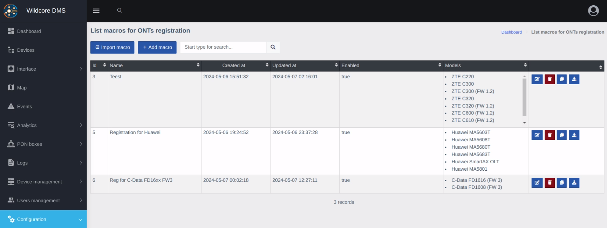

!!! abstract "Огляд"
    Ця сторінка надає опис компоненту **Реєстрація ОНУ**.

    Цей компонент перевіряє наявність незареєстрованих ОНУ та дозволяє реєстрацію нових за допомогою заповнення короткої форми та працює для всіх типів OLT.

!!! info "Інформація"
    Компонент можна знайти через **Конфігурація > Реєстрація ОНУ**.

    

    Також, на **Дешборді** є віджет **Незареєстровані ОНУ**, який автоматично виводить такі ОНУ автоматично.

    

## Як це працює
Після виявлення незареєстрованого ОНУ, він з'явиться у списку (на віджеті, для всіх пристроїв та на сторінці самого пристрою).

Після натискання кнопки "Зареєструвати" відкриється форма реєстрації. Поля динамічно генеруються на основі параметрів, підготовлених конфігурацією реєстрації.

Коли ви заповните форму та натиснете кнопку реєстрації, список команд згенерується на основі шаблону, введених параметрів та параметрів, отриманих з самого пристрою та ОНУ.

Якщо компіляція шаблону пройшла успішно, команди буде виконано на ОЛТ.

Після успішної реєстрації, буде виведено відповідне повідомлення і вас буде автоматично перенаправлено на сторінку нового ОНУ.

!!! note "Примітка"
    Щоб побачити шаблони реєстрації, ваш аккаунт має мати відповідні дозволи.

!!! note "Примітка"
    Повний вивід консолі під час реєстрації можна подивитися у логах звернень до обладнання (модуль multi_console_command) і у випадку успішних реєстрацій, і у випадку помилок.

    У випадку помилки у будь-якій з команд, виконання команд буде зупинено.
    Помилка може виникнути після виконання команд реєстрації ОНУ.

    У цьому випадку, вам необхідно спершу знайти номер ОНУ, під яким він був зареєстрований, та вручну сконфігурувати його на ОЛТ (або видалити та спробувати знову). 

    Шаблони побудовані за допомогою системи [**Twig**](https://twig.symfony.com/), що дозволяє включення змінних у команди, оголошення та призначення додаткових змінних, або навіть виконання логіки чи обробки тексту всередині шаблону.

    За додатковою інформацією зверніться до [документації Twig](https://twig.symfony.com/doc/3.x/templates.html).

    
    Якщо ви маєте унікальні налаштування для кожного окремого ОЛТ, ви можете вказати їх у додаткових параметрах пристрою та використовувати у шаблоні або параметрах. Поширеною практикою є визначення користувацьких VLAN (для окремих портів або всього пристрою). Такі параматри будуть доступні у об'єкті `device.params`.

## Огляд процесу Реєстрації

!!! tip "Підказка"
    Детальний посібник з реєстрації ОНУ можна знайти на сторінці [**Створення макросу реєстраційного шаблону**](./registration-macro.md) та [**Реєстрація ОНУ на сторінці пристрою**](./registration-device.md).

1. Створіть макрос реєстрації на сторінці **Реєстрація ОНУ**.

    !!! note "Ключові відміни від звичайних макросів"
        - **Загальне**: Тут доступні лише поля назви та вказання пристрою.
        - **Параметри**: Замість вибору **Інтерфейсу**, тут випадаюче меню **Незареєстровані ОНУ**. Тут вказані лише ті ОНУ, яку були виявлені як незареєстровані.
        - **Шаблон**: Так само як **Параметри**.

2. Перейдіть на сторінку **Пристрою**, для якого ви хочете зареєструвати ОНУ, знайдіть його у вкладці **Незареєстровані ОНУ** на натисніть кнопку **Зареєструвати**.
3. Виконайте підготовлений вище макрос.

Якщо все пройшло без помилок, вас буде перенаправлено на сторінку тільки-но зареєстрованого ОНУ.

