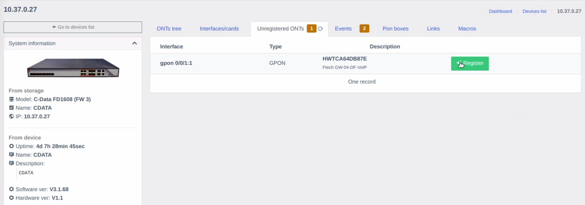
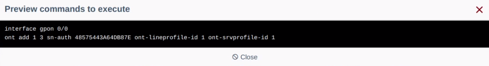
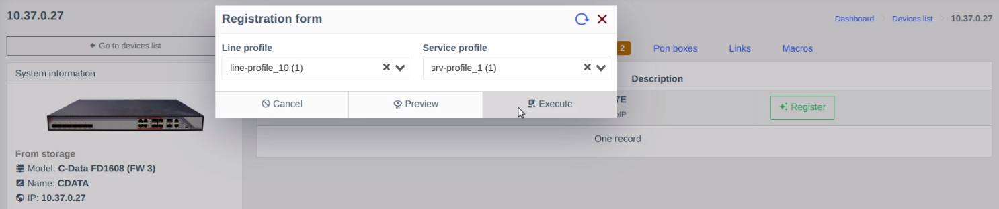
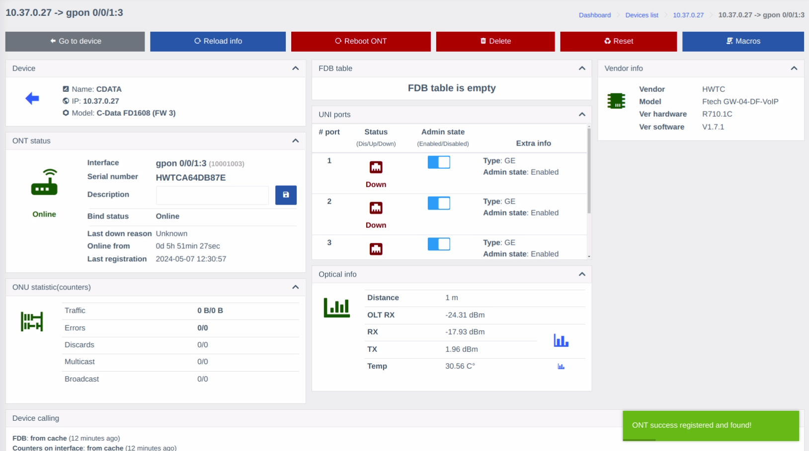

# Рєєстрація ОНУ на сторінці пристрою

1. Перейдіть до сторінки Пристрою, для якого хочете зареєструвати ОНУ, оберіть вкладку **Незареєстровані ОНУ** та натисніть кнопку **Зареєструвати**.

    

2. З'явиться спливаюче вікно. Оберіть бажані Профілі з випадаючих меню.

    Перед виконанням можна натиснути **Попередній перегляд**.

    

    !!! tip "Підказка"
        Якщо вам здається, що з формою щось не так, натисніть кнопку **Перезавантижити**  у верхньому правому кутку.

        За замовчуванням форма бере дані з кешу, а кнопка перезавантаження змушує оновити їх.
        
    Якщо попередній вигляд команди виглядяє корректно, можете натиснути кнопку **Виконати**.

    

3. Якщо все пройшло без помилок, вас буде перенаправлено на сторінку тільки-но зареєстрованого ОНУ.
    