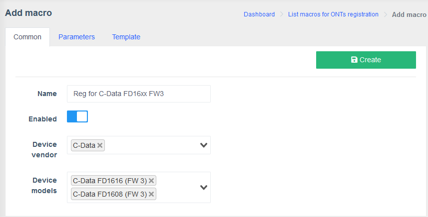
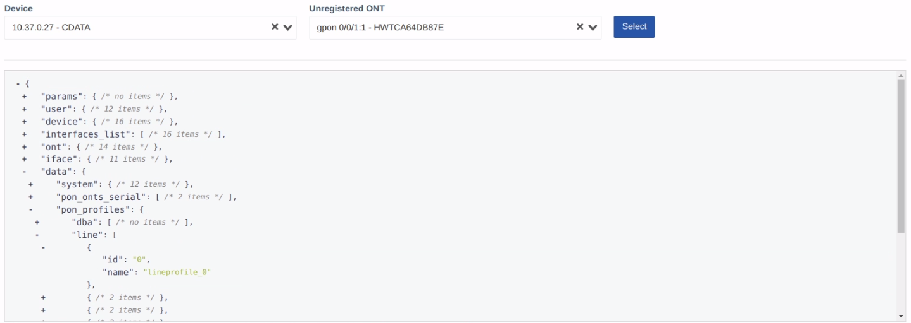
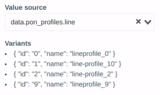
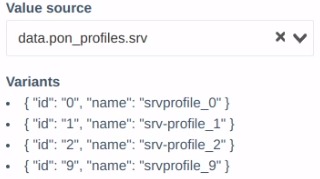
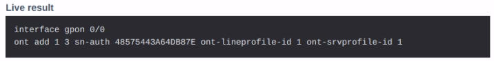

# Створення макроса шаблону реєстрації

!!! tip "Підказка"
    Якщо ви не знайомі с системою **Макросів**, детальний посібник та опис усіх полей і параметрів можна знайти у розділі [**Макроси**](../../components/macros/getting-started.md) цієї документації.

!!! warning "Увага"
    Для однієї моделі пристрою може бути лише один макрос реєстрації, інакше ви отримаєте помилку.

### Загальне
!!! quote ""
    1. **Ім'я:** `Reg for C-Data FX16xx FW3`
    2. **Включено**: `Yes`
    2. **Виробник пристрою:** для цієї демонстрації ми використаємо виробника `C-Data`
    3. **Моделі пристроїв:** `C-Data FD1616 (FW3)`, `C-Data FD1608 (FW3)`

    ??? example "Приклад"
        

### Параметри
!!! quote ""
    Оберіть пристрій виробника C-Data та ОНУ, що хочете зареєструвати з випадаючих меню у верхній частині сторінки.

    

    Додайте новий **Параметр**.

    1. **Властивість:** `line`
    2. **Відображувана назва властивості:** `Line profile`
    3. **Обов'язковий:** `Так`
    4. **Тип параметру:** `Випадний список зі змінних`
    5. **Джерело значень:** `data.pon_profiles.line`

        ??? example "Приклад профілів"
            

        ???+ info "Інформація"
            Профілі, що ви отримаєте з пристрою можуть відрізнятися від тих, що ви бачите у прикладі.

            У такому випадку вам потрібно внести відповідні зміни у макрос.
    
    6. **Назва елемента:** `${item.name} (${item.id})`
    7. **Фільтр елементів:** `item.id != 0`

    Додайте ще один **Параметр**.

    1. **Властивість:** `srv`
    2. **Відображувана назва властивості:** `Service profile`
    3. **Обов'язковий:** `Так`
    4. **Тип параметру:** `Випадний список зі змінних`
    5. **Джерело значень:** `data.pon_profiles.srv`
        
        ??? example "Приклад профілів"
            

        ???+ info "Інформація"
            Профілі, що ви отримаєте з пристрою можуть відрізнятися від тих, що ви бачите у прикладі.

            У такому випадку вам потрібно внести відповідні зміни у макрос.
    
    6. **Назва елемента:** `${item.name} (${item.id})`
    7. **Фільтр елементів:** `item.id != 0`

### Шаблон
!!! quote ""
    Оберіть пристрій виробника C-Data та ОНУ, що хочете зареєструвати з випадаючих меню у верхній частині сторінки.

    

    **Блок шаблону:** 
    
    Скопіюйте та вставте наступну команду:

    ``` twig
    interface gpon 0/0
    ont add {{iface._port}} {{free.first}} sn-auth {{ont._serial_hex}} ont-lineprofile-id {{params.line.id}} ont-srvprofile-id {{params.srv.id}}
    ```
    Якщо макрос спрацював, ви маєте побачити схожий вивід у полі **Результат**.
    
    