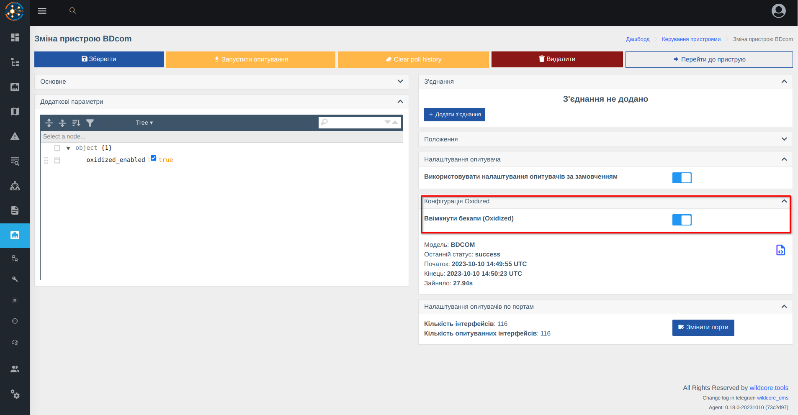
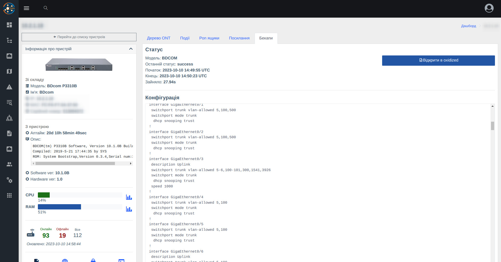
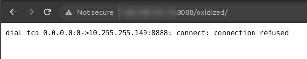
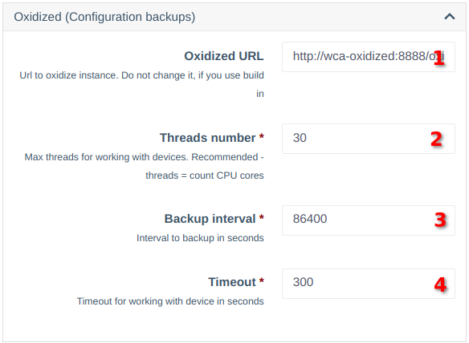

# Бекапи конфігурації
Компонент реалізує взаємодію з ПО [Oxidized](https://github.com/ytti/oxidized).     
За допомогою oxidized можливо знімати бекапи через SSH/Telnet і зберігати їх в локальному Git репозиторії.   

## Функціонал, який реалізовано в Wildcore
**1. Вбудованний в систему і налаштований oxidized (з можливістю обемеження доступу для користувачів)**         
     
**2. Ввімкнення збору бекапів через налаштування обладнання**

     
**3. Перегляд актуального конфігу в спеціальній вкладці обладнання (з можливістю обмеження для користувачів)**     


**4. Посилання на обладнання в oxidized, яке дозволить переглянути зміни**    


## ❗Примітки щодо запуску 
1. За замовчуванням зняття бекапів вимкнено;
2. Якщо в системі немає ні одного обладнання, з якого потрібно знімати бекап - Oxidized працювати не буде (в зовнішніх додатках ви отримаєете помилку); 
   
3. Після того, як ввімкнули на першому обладнанні, oxidized запрацює через деякий час (перевірка раз в 5хв.);    
   Якщо не хочете чекати, можете перезавантажити контейнер самостійно - ```docker restart wca-oxidized```.   

## Налаштування
В налаштуваннях системи блок Oxidized, який дозволяє налаштувати деякі параметри    
     

1. **URL до API Oxidized** - Якщо ви не плануєте використовувати зовнішній екземпляр ПО - цей параметр міняти не потрібно;
2. **Threads number** - З якої кількості обладнання можна знімати бекап одночасно (змініть під свою систему, при необхідності);
3. **Backup interval** - З якою періодичністю знімати бекапи. Час вказується в секундах;
4. **Timeout** - Час на зняття бекапу, в секундах    

_При зміні параметрів відмічених (*), потрібно буде перезапустити систему командою_
```
cd /opt/wildcore-dms && docker compose up -d --build
```

## Зберігання конфігурацій в своєму Git-репозиторії
_Щоб відправляти конфігурацію в свій Git, потрібно, щоб в вашій системі був встановлений і налаштований git._     

**1. Налаштуйте локальний репозиторій**
```shell
git config --global --add safe.directory /opt/wildcore-dms/var/oxidized/configs.git
git remote add origin <ВАШ РЕПОЗИТОРІЙ>
git push --set-upstream origin master
```
**2. Додайте задачу в крон, щоб відправляти зміни**
```shell
*/5 * * * * cd /opt/wildcore-dms/var/oxidized/configs.git && git push --set-upstream origin master
```

## Підтримка обладнання    
**Oxidized** - відкритий продукт, з відкритим кодом.            
Завдяки відкритості, ви можете підняти свій екземпляр окремо і додати підтримку необхідного обладнання.    
Також ви можете звернутись до нас, щоб ми додали необхідне обладнання (якщо воно вже є в wildcore)

Щоб wildcore міг працювати з вашим особистим екземпляром - змініть адресу до Oxidized в налаштуваннях системи.    
Також, щоб Oxidized отримував список обладнання для збору, вкажіть наступний конфіг: 
``` 
source:
  default: http
  http:
    url: http://<АДРЕСА СИСТЕМИ WILDCORE>/api/v1/component/oxidized/internal/devices-list
    scheme: http
    delimiter: !ruby/regexp /:/
    read_timeout: 120
    map:
      ip: ip
      name: name
      model: model
      username: login
      password: password
      input: input
      full_name: full_name
    vars_map:
      enable: enable
      telnet_port: telnet_port
      ssh_port: ssh_port
      remove_secret: remove_secret
```
_зважайте, що сервер с oxidized повинен бути прописанний в дозволених IP_