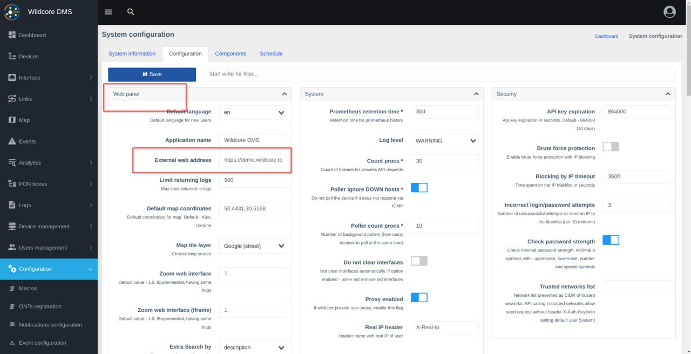
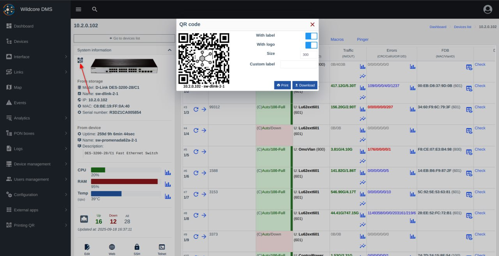
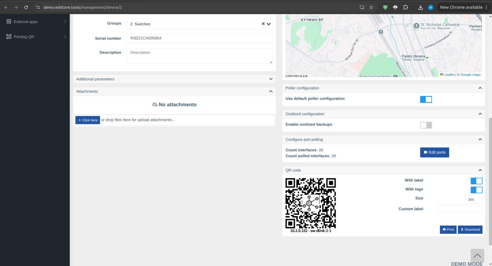
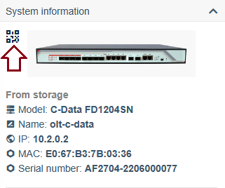
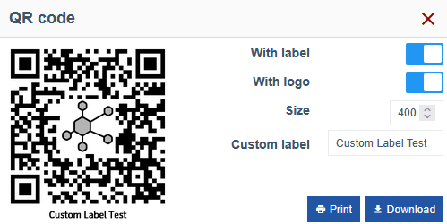
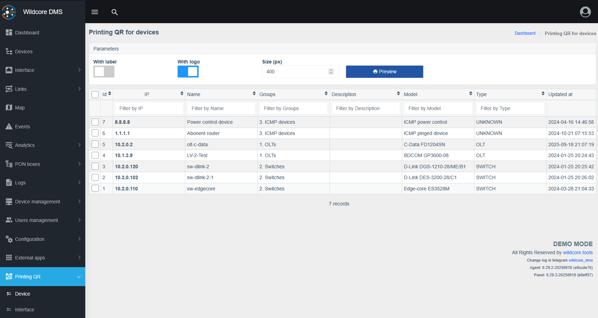
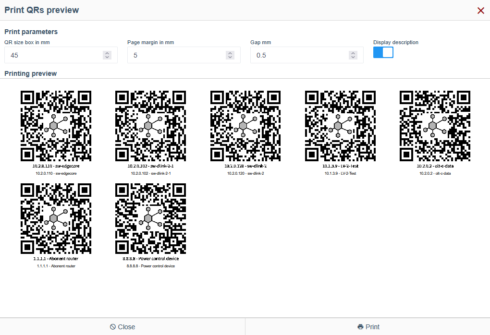
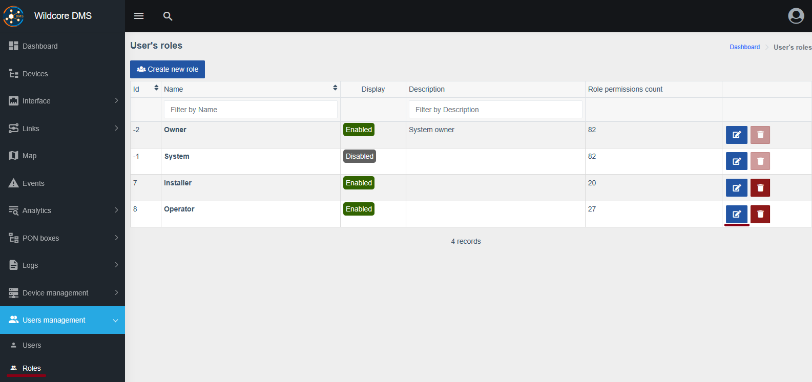
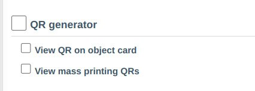

# Генератор QR-кодів

!!! abstract "Огляд"
    
    **Генератор QR-кодів** це компонент що дозволяє сгенерувати QR-код з прямим посиланням на ваш об'єкт (пристрій/інтерфейс) у WildCore.
    
!!! warning "Увага"
    **Генератор QR-кодів** потребує WildCore верії `>=0.29`. Інструкції з оновлення можна знайти [тут](../installation-and-updating/update.md).
    
    Після оновлення компонент увімкнений та доступний за замовчуванням.
    
## Налаштування
Для коректної роботи **Генератора QR-кодів** потрібне певне налаштування.

1. Перейдіть до `Конфігурація > Конфігурація системи > Конфігурація системи`.
2. Вкажіть правильну "Зовнішню веб-адресу" для вашого WildCore.
3. Натисніть `Зберегти` у верхній частині сторінки.

??? quote "Візуальна допомога"
    

## Генерація та друк QR-кодів
### Місцезнаходження QR-кодів

QR-коди для ваших пристроїв і інтерфейсів можна знайти у декількох місцях, а також на спеціальній сторінці масового друку, що знаходиться у боковому меню.

Щоб знайти потрібний QR-код, ви можете перейти до:

1. Дешборду пристрою/інтерфейсу.

    ??? quote "Візуальна допомога"
        
        

2. Центральної сторінка масового друку QR-кодів, що відповідає типу об'єкта

    ??? quote "Візуальна допомога"
        

На цих сторінках ви можете переглянути, завантажити або надрукувати код напряму.

### Друк QR-кодів

Процес друку простий, але конкретні кроки можуть дещо відрізнятися залежно від сторінки.

#### Друк з дешборду пристрою/інтерфейсу

1. Перейдіть до дешборду пристроя/інтерфейса.
2. Знайдіть розділ іх QR-кодом, як показано у розділі "Візуальна допомога" [вище](#qr_2).

    Для пристроїв, це іконка зліва зверху від його зображення на панелі `Інформація про пристрій`.

    ??? quote "Візуальна допомога"
        
    
    Для інтерфейсів розділ `QR-код` знаходиться внизу сторінки.

3. Налаштуйде вигляд та розмір QR-коду.    

    Ви можете додати свій логотип, змінити мітку або розміри коду у пікселях.

    ??? quote "Візуальна допомога"
        

4. Натисніть `Завантажити` або `Друк`.

#### Друк зі сторінки масового друку QR-кодів

1. Перейдіть до `Друк QR > Пристрій` або `Друк QR > Інтерфейси`, залежно від типу об'єкта, який вам потрібен.
 
    ??? quote "Visual aid"
        

2. Оберіть підходящі пристрої, позначивши їх галочками.
3. Увімкніть необхідні опції у верхній частині сторінки, такі як `З підписом` або `З логотипом`, та оберіть відповідний розмір.
4. Натисніть `Попередній перегляд` та налаштуйте параметри розміщення кодів на аркуші.

    Доступні наступні параметри:
    - `Розмір QR у мм`: фізичний розмір надрукованого коду на аркуші
    - `Відступ сторінки у мм`: відстань від краю аркуша
    - `Проміжок (мм)`: відстань між кодами на аркуші

    Ці налаштування можна змінити, щоб розмістити коди потрібним чином, що може бути корисно при друку наліпок різних форматів.

    ??? quote "Візуальна допомога"
        

5. Натисніть `Друк`.

## Дозволи

!!! info "Інформація"
    Для перегляду кодів у дешбордах об'єктів та на сторінці масового друку доступні окремі дозволи.

1. Перейдіть до `Користувачі > Ролі` та натисніть `Змінити` біля потрібної ролі.

    ??? quote "Візуальна допомога"
        

2. Знайдіть розділ `Генератор QR` та відмітьте необхідні галочки.

    Не забудьте збереги зміни у верхній частині сторінки.

    ??? quote "Візуальна допомога"
        