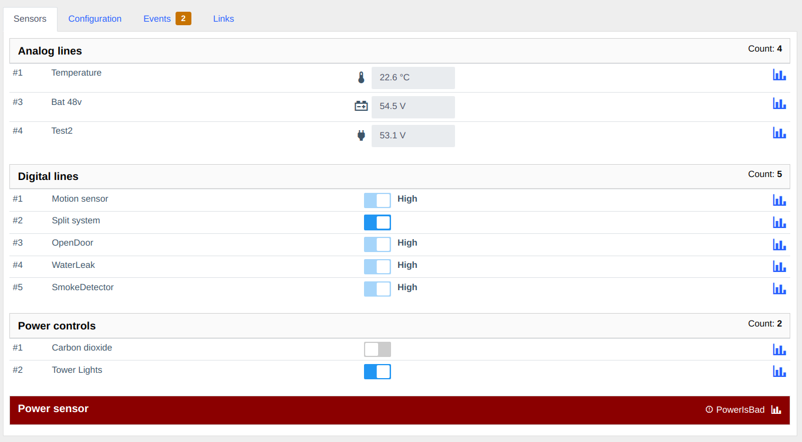
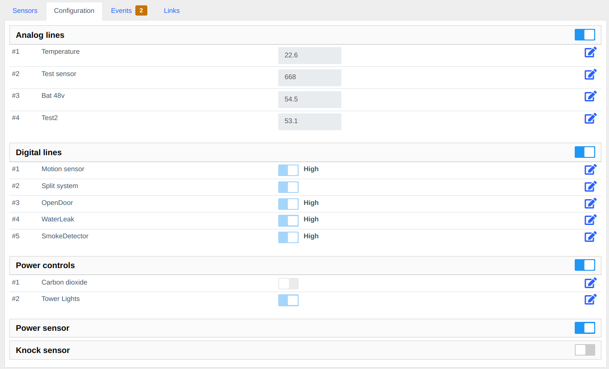
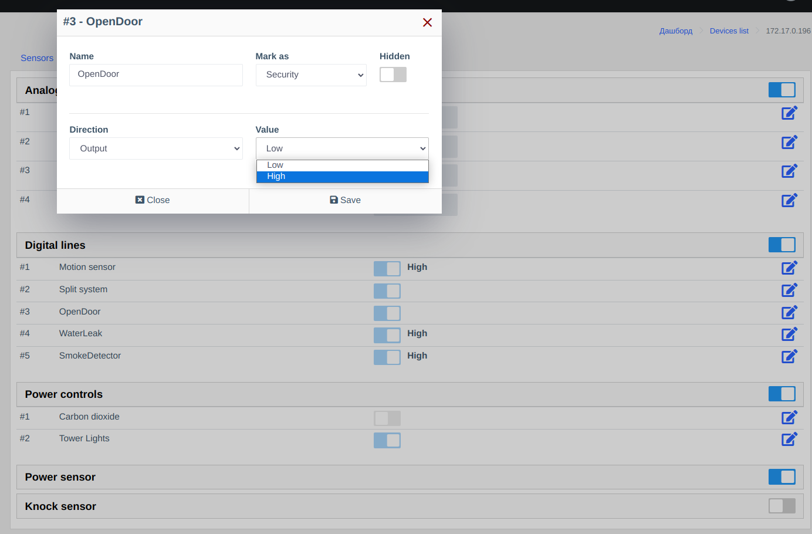

# Компонент сенсори (sensors)
Дозволяє працювати з пристроями віддаленого моніторингу та управління.    
На даний час підтримується тільки пристрої типу "Ping3"        

Так як це достатньо універсальний пристрій, має аналогові та цифрові лінії, работу з пристроєм потрібно додатково налаштовувати.    
Отримання значень відбувається через SNMP.     

## Функціонал

**Веб-панель**          

- Перегляд данних з сенсорів     
- Перегляд історії показників      
- Управління цифровими входами та виходами 220В     
- Можливість задати ім'я      

**Метрики:**

- device_sensor  

**Опитувальники:**         

- system
- sensors_data    

## Скріншоти

## Примітки    
### Отримуванні значення
Отриманні значення по SNMP відображаться і зберігаються за формулою - value/10.    
Це потрібно враховувати при налаштуванні пристрою.       

### Автодетект 
Пристрої PING3 не додаються автоматично за допомогою автовиявлення, а також при додаванні нового пристрою потрібно вручну вказати модель.     

