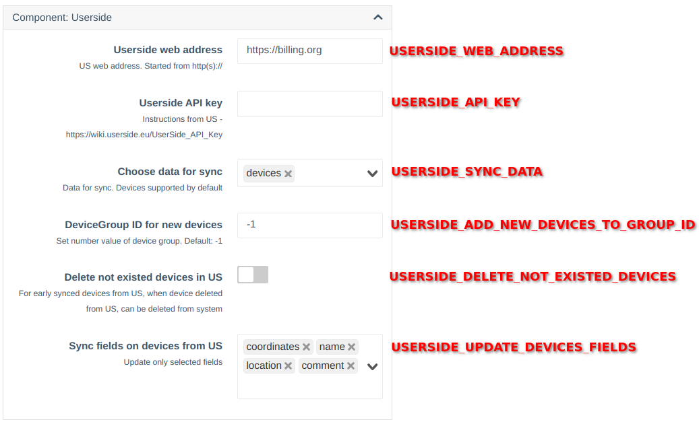

# Userside API integration

!!! info "Компонент доступний з версії **0.26** "
### Опис
Цей компонент призначений для синхронізації даних з системи Userside.      
В даний час дозволяє синхронізувати обладнання, включаючи його доступ (credentials), ім'я, координати та коментарі.


!!! warning "Якщо у обладнання було змінено доступи (community, логін чи пароль) в системі Userside, їх потрібно оновити вручну в WildCore"

!!! info "Під час синхронізації можуть бути автоматично створені нові доступи, якщо в системі не було знайдено аналогів (за комуніті, логіном та паролем) до того, що надійшло з Userside"


### Встановлення та налаштування
Компонент є вбудованим і не потребує окремого встановлення. Перед початком використання його необхідно увімкнути.

!!! info "Для налаштування API в системі Userside скористайтеся інструкцією: [https://wiki.userside.eu/UserSide_API_Key](https://wiki.userside.eu/UserSide_API_Key)"

#### Налаштування планувальника
!!! info "При ввімкнені компонента, автоматично буде додано запис в планувальник завдань і ввімкнеться автоматична синхронізація"

#### Налаштування 


**Опис параметрів**:    

* **USERSIDE_WEB_ADDRESS** - Веб-адреса вашого інсталяції Userside

* **USERSIDE_API_KEY** - Ключ API для доступу до Userside    

* **USERSIDE_SYNC_DATA** - Типи даних, які потрібно синхронізувати     
    
    Тип: `multiselect`     
    Варіанти: `['devices']`    
    За замовчуванням: `['devices']`      

* **USERSIDE_ADD_NEW_DEVICES_TO_GROUP_ID** - ID групи, до якої будуть додані нові пристрої. 

    !!! info "ID групи можна переглянути у management/device-group"
    !!! info "Рекомендується створити окрему групу для нового обладнання, а потім вручну перемістити його. "

* **USERSIDE_DELETE_NOT_EXISTED_DEVICES** - Видаляти пристрої, яких більше немає в Userside.    

    Тип: `checkbox`    
    За замовчуванням: `no`    

    !!! info "Ця опція працює для обладнання, яке було раніше додано або оновлено з Userside."
    !!! warning "Видалення чи зміна в Userside може привести до видалення обладнання з Wildcore! "

* **USERSIDE_UPDATE_DEVICES_FIELDS** - Поля пристроїв, які необхідно оновлювати під час синхронізації.   

    Тип: `multiselect`   
    Варіанти: `['coordinates', 'name', 'location', 'comment']`   
    За замовчуванням: `['coordinates', 'name', 'location', 'comment']`   
 

!!! noty "Після внесення і збереження параметрів рекомендується запустити першу синхронізацію вручну"

#### Перевірка роботи
```shell 
sudo wca -v userside_integration:sync 
```
 
**Опис команди**:
```shell

wca userside_integration:sync --help
Description:
  Sync data from userside

Usage:
  userside_integration:sync [<load-only>...]

Arguments:
  load-only             Sync only types [default: ["devices"]]

Options:
  -h, --help            Display help for the given command. When no command is given display help for the list command
  -q, --quiet           Do not output any message
  -V, --version         Display this application version
      --ansi|--no-ansi  Force (or disable --no-ansi) ANSI output
  -n, --no-interaction  Do not ask any interactive question
  -v|vv|vvv, --verbose  Increase the verbosity of messages: 1 for normal output, 2 for more verbose output and 3 for debug

```
