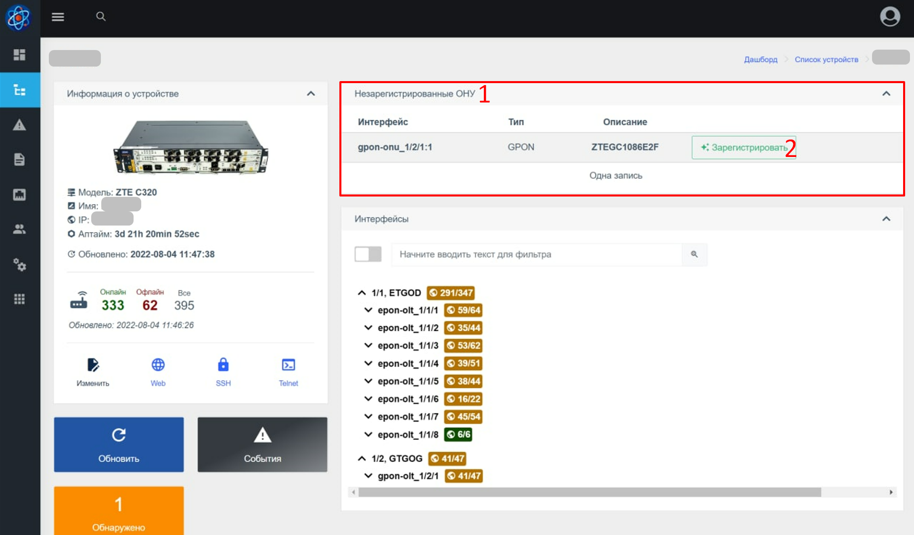
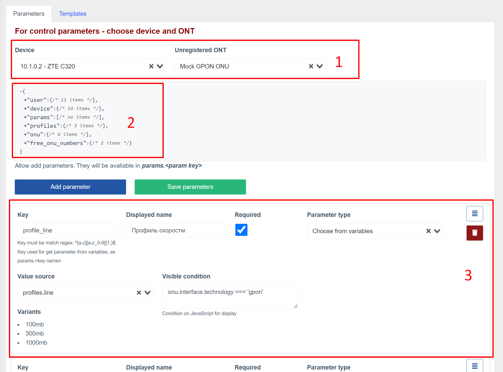

# Реєстрація ОНУ на ОЛЦ ZTE
Цей компонент перевіряє наявність незареєстрованих ONU на ZTE OLT.
Це також дозволяє реєструвати нові/незареєстровані ONU, заповнивши коротку форму.

## Як це працює?
Після виявлення незареєстрованого ONU він починає відображатися в списку (на панелі, для всіх пристроїв і в самому пристрої).
Після натискання кнопки «Зареєструватися» відкривається реєстраційна форма.
Поля форми для заповнення динамічно генеруються на основі параметрів, підготовлених інженером.
Після заповнення полів форми та натискання кнопки реєстрації складається список команд для реєстрації ОНУ на основі шаблону, введених параметрів та параметрів, отриманих від пристрою та незареєстрованого ОНУ.
Якщо компіляція шаблону пройшла успішно, команди будуть виконані на OLT.
Після успішної реєстрації - сповіщення про успішну реєстрацію буде відображено та автоматично перенаправлено до нового ONU.

### Примітки

* Весь вихід консолі при реєстрації можна переглянути в журналах викликів обладнання (модуль multi_console_command), як для успішної реєстрації, так і в разі помилки;
* У разі помилки будь-якої з команд, виконання команд буде призупинено.
Виконання може бути призупинено вже після введених команд для самої реєстрації ONU.
В цьому випадку потрібно знайти під ONU, під яким номером він був зареєстрований і вручну налаштувати його через інженер на OLT (або видалити його і спробувати зареєструвати знову);
* Щоб створити шаблон, використовуйте [twig](https://twig.symfony.com/). Використовуйте офіційну документацію для механізму шаблонів, щоб дізнатися, які функції доступні. Наприклад, розгалуження (якщо-інакше);
* Якщо у вас є якісь унікальні налаштування на кожному окремому OLT - ви можете вказати їх у додаткових параметрах пристрою та використовувати в шаблоні або параметрах. Поширеною практикою є визначення користувацьких vlans (для окремих портів або всього пристрою). Такі параметри будуть доступні в об’єкті `device.params`

## Компонент веб-інтерфейсу
### Реєстрація незареєстрованого ОНУ
**Список незареєстрованих ONU на пристрої**

** Реєстраційна форма ОНУ **

### Конфігурація реєстрації
**Сторінка конфігурації**

**Вкладка налаштувань параметрів**

1. Блок вибору пристрою та ONU. У списку пристроїв відображаються лише ZTE OLT. Вам потрібно вибрати пристрій і незареєстрований ONU, щоб отримати список динамічних параметрів.
2. Змінні, доступні після вибору пристрою та ONU, які можна використовувати в налаштуваннях полів реєстраційної форми
3. Поле реєстраційної форми

**Вкладка налаштувань шаблону**

1. Блок вибору пристрою та ONU. У списку пристроїв відображаються лише ZTE OLT. Вам потрібно вибрати пристрій і незареєстрований ONU, щоб отримати список динамічних параметрів.
2. Реєстраційна форма, підготовлена на [вкладці параметрів](#config_params)
3. Змінні, доступні після вибору пристрою, ONU та заповнення параметрів форми, які можна використовувати для створення шаблону
4. Блок зміни шаблону (під шаблоном також можна переглянути згенерований набір команд)

## Змінні
Змінні - це вкладені об'єкти з полями.
Значення полів об’єкта формується автоматично на основі поточного користувача, обладнання, на якому знаходиться незареєстрований ONU.

Ви можете використовувати ці змінні для створення шаблону, а також поведінки реєстраційної форми.

**Кореневий об’єкт містить такі поля**:

* **user** - поточний користувач у системі
* **пристрій** - пристрій, на якому виконується реєстрація
* **params** - значення, що вводяться в реєстраційну форму
* **профілі** - список лінійних і віддалених профілів, отриманих від OLT
* **onu** - ONU, що реєструється
* **free_onu_numbers** - містить два поля (перший вільний onu) і список усіх вільних onu на порту, де знаходиться незареєстрований ONU.

## Параметри форми реєстрації
### У системі доступні наступні типи параметрів:
* Вибір (розкривний список) із попередньо встановлених значень
* Вибір (розкривний список) змінних
* Поле введення зі значенням за замовчуванням із змінної
* Поле введення

### Типовий блок конфігурації параметрів (наприклад, тип є вибором із попередньо встановлених значень)

1. **Key(key)*** - За назвою ключа можна буде отримати доступ до значення параметра в шаблоні, який буде доступний за params.KEY_NAME. Ключі бажано вводити тільки латиницею і, при необхідності, використовувати символи підкреслення;
2. **Відображене ім'я*** - Назва поля, яке буде відображатися в реєстраційній формі;
3. **Прапорець «обов’язковий»** - вказує на те, що під час реєстрації це поле необхідно заповнити (або вибрати в разі випадання);
4. **Тип параметра*** - тип параметра. Ви повинні вибрати одне з наступного;
5. **Видима умова** - умова javascript для відображення поля. Має повертати true або false залежно від змінних.
6. **Кнопка сортування** - утримуючи кнопку, ви можете перетягувати параметр вгору/вниз. Це змінить порядок полів у реєстраційній формі
7. **Кнопка видалення параметра**

_* - Обов'язкове поле_

### Параметри за типами полів
**Виберіть із попередньо встановлених параметрів**

1. Тут ви можете вивести список опцій (з нового рядка) для вибору під час реєстрації

**Виберіть зі змінної**

1. Джерело значень (у списку відображаються лише масиви, що містять примітивні значення)
2. Після вибору - виводиться список значень

**Поле введення зі значенням за замовчуванням із змінної**

1. Джерело значення (у списку відображаються лише змінні примітивного типу)
2. Значення за замовчуванням, якщо немає змінної або порожнє
3. Регулярний вираз для вхідного значення

**Поле введення зі значенням за замовчуванням із змінної**

1. Значення за замовчуванням
2. Регулярний вираз для вхідного значення

## Шаблон команди
Шаблон використовується для створення списку команд, які будуть виконуватися на OLT під час реєстрації ONU.
При складанні шаблону необхідно використовувати змінні.
Під блоком шаблону знаходиться інший блок, який компілює шаблон і дозволяє переглядати остаточний список команд, які виконуватимуться на апаратному забезпеченні.
Складання остаточного списку команд буде працювати тільки при виборі обладнання, ONU. Також рекомендується заповнити форму.

1. Шаблонний блок
2. Блок живих результатів (остаточний список команд)

## Вказівки щодо налаштування журналювання
* Додайте ZTE OLT
* Додати незареєстрований ONU в мережу на цьому OLT

Це дозволить вам більш детально зрозуміти, що таке змінні і як вони заповнюються.

