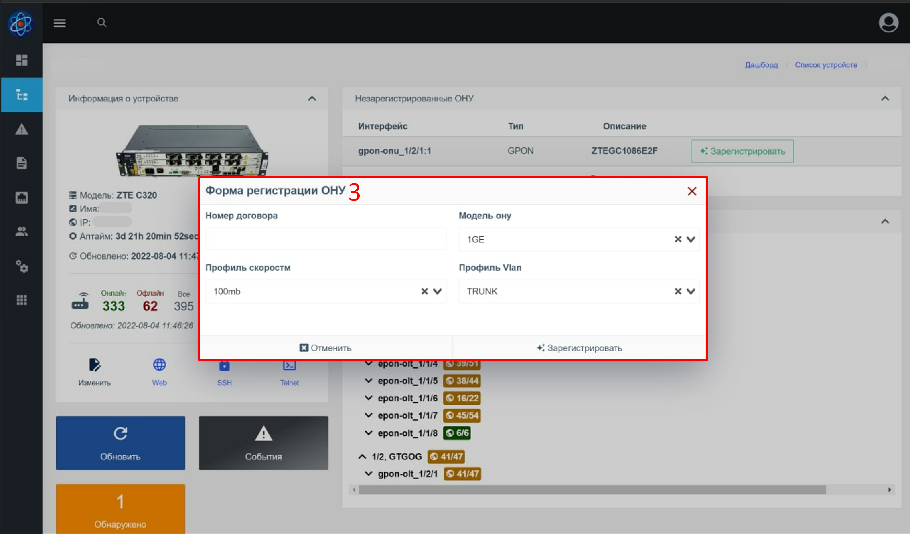

# Реєстрація ОНУ на OLTs ZTE
Цей компонент перевіряє наявність незареєстрованих ОНУ на ОЛТ ZTE.
Також дозволяє проводити реєстрацію нових/незареєстрованих ОНУ, заповнивши невелику форму.

## Як це працює?
Після виявлення незареєстрованої ОНУ вона починає відображатися в списку (на дашборді, по всіх пристроях і в самому пристрої).
При натисканні кнопки "Зареєструвати" відкривається форма форма реєстрації.
Поля форми заповнення генеруються динамічно з урахуванням підготовлених інженером параметрів.
Після заповнення полів форми та натискання кнопки зареєструвати – компілюється список команд для реєстрації ОНУ на основі шаблону, введених параметрів та отриманих параметрів із пристрою та незареєстрованої ОНУ.
Якщо компіляція шаблону успішна, команди виконуються на ОЛТ.
При успішній реєстрації – відобразиться повідомлення про успішну реєстрацію та автоматично переадресує на нову ОНУ.

### Примітки

* Весь консольний висновок з реєстрації можна подивитися в логах виклику обладнання (модуль multi_console_command) як для успішної реєстрації, так і при помилці;
* У разі помилки на якійсь із команд - виконання команд буде призупинено.
Виконання може бути зупинено вже після введених команд на саму реєстрацію ОНУ.
В цьому випадку необхідно знайти під ОНУ, під яким номером вона зареєструвалася і доналаштувати вручну вже через інженера на ОЛТ (або видалити її і спробувати провести реєстрацію заново);
* Для створення шаблону використовується [twig](https://twig.symfony.com/). Скористайтеся офіційною документацією до шаблонизатора, щоб дізнатися які можливості є. Наприклад, можуть стати в нагоді розгалуження (if-else);
* Якщо у вас є якісь унікальні параметри налаштування на кожному окремому ОЛТ - ви можете вказати їх у додаткових параметрах пристрою та використовувати їх у шаблоні або параметрах. Частою практикою є вказівка вланів користувача (для окремих портів або всього пристрою). Такі параметри будуть доступні в об'єкті `device.params`

## Компонент у веб-інтерфейсі
### Реєстрація незареєстрованої ОНУ
**Список незареєстрованих ОНУ на пристрої**

**Форма реєстрації ОНУ**

### Конфігурація реєстрації
**Сторінка конфігурації**

**Вкладка параметрів**

1. Блок вибору пристрою та ОНУ. У списку пристроїв відображаються лише ОЛТ ZTE. Потрібно вибрати пристрій та незареєстровану ОНУ, щоб отримати список динамічних параметрів.
2. Змінні, доступні після вибору пристрою та ОНУ, які можна використовувати у налаштуваннях полів форми реєстрації
3. Поле форми реєстрації

**Вкладка налаштування шаблону**

1. Блок вибору пристрою та ОНУ. У списку пристроїв відображаються лише ОЛТ ZTE. Потрібно вибрати пристрій та незареєстровану ОНУ, щоб отримати список динамічних параметрів.
2. Форма реєстрації, підготовлена на [вкладці параметрів](#config_params)
3. Змінні, доступні після вибору пристрою, ОНУ та заповнення параметрів форми, які можна використовувати для складання шаблону
4. Блок зміни шаблону (під шаблоном також можна переглянути згенерований набір команд)

## Змінні
Змінні являють собою вкладені об'єкти з полями.
Значення полів об'єктів генерується автоматично з урахуванням поточного користувача, устаткування, у якому перебуває незареєстрована ОНУ.

Ви можете використовувати ці змінні для генерації шаблону, а також поведінки форми реєстрації.

**У кореневому об'єкті містяться такі поля**:

* **user** - поточний користувач у системі
* **device** - пристрій, на якому здійснюється реєстрація
* **params** - значення введені у формі реєстрації
* **profiles** - список line та remote профайлів отриманих з ОЛТ
* **onu** - ОНУ, яка реєструється
* **free_onu_numbers** - містить два поля (перша вільна вона) і список всіх вільних вона на порту, де знаходиться незареєстрована ОНУ.

## Параметри форми реєстрації
### У системі доступні такі типи параметрів:
* Вибір(випадок) із встановлених значень
* Вибір (випадок) зі змінних
* Поле для введення з дефолтним значенням із змінної
* Поле для введення

### Типовий блок конфігурації параметра (на прикладі тип - вибір із встановлених значень)

1. **Ключ(key)*** - На ім'я ключа можна буде отримати доступ до значення параметра в шаблоні, який буде доступний за params.ІМ'Я_КЛЮЧА. Бажано вводити ключі тільки на латиниці та за необхідності використовувати нижні підкреслення;
2. **Відображуване ім'я(displayed name)*** - Ім'я поля, яке відображатиметься у формі реєстрації;
3. **Прапор "обов'язкове"** - вказує на те, що при реєстрації це поле обов'язково має бути заповнене (або обрано у разі випадки);
4. ** Тип параметра (parameter type) *** - Тип параметра. Необхідно вибрати один із перерахованих;
5. **Умова відображення(Visible condition)** - умова на JavaScript для відображення поля. Залежно від змінних слід повертати true або false.
6. **Кнопка сортування** - затиснувши кнопку, можна перетягнути параметр вище/нижче. Це змінить порядок полів у формі реєстрації
7. **Кнопка видалення параметра**

_* - обов'язкове для заповнення_

### Параметри за типами полів
**Вибір із попередньо встановлених параметрів**

1. Тут можна перерахувати список варіантів (з нового рядка) для вибору під час реєстрації

**Вибір зі змінної**

1. Джерело значень (у списку відображаються тільки масиви, що містять примітивні значення)
2. Після вибору – відображається список значень

**Поле для введення з дефолтним значенням із змінної**

1. Джерело значення (у списку відображаються лише змінні з примітивним типом)
2. Значення за замовчуванням, якщо змінної немає чи порожнє
3. Регулярний вираз для значення, що вводиться

**Поле для введення з дефолтним значенням із змінної**

1. Значення за замовчуванням
2. Регулярний вираз для значення, що вводиться

## Шаблон команд
Шаблон використовується для створення списку команд, які виконуються на ОЛТ під час реєстрації ОНУ.
При складанні шаблону потрібно використовувати змінні.
Під блоком шаблону знаходиться ще один блок, який компілює шаблон та дозволяє переглянути підсумковий список команд, який буде виконано на обладнанні.
Компіляція підсумкового списку команд працюватиме лише при виборі обладнання ОНУ. Також рекомендується заповнити форму.

1. Блок шаблону
2. Блок живого результату (підсумковий список команд)

## Рекомендації щодо налаштування реєстрації
* Додати ОЛТ ZTE
* Додайте незареєстровану ОНУ в мережі на цьому ОЛТ

Це дозволить більш детально розібратися, які змінні є і як заповнюються.

