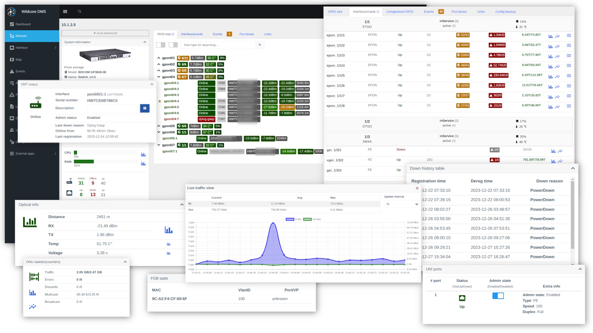
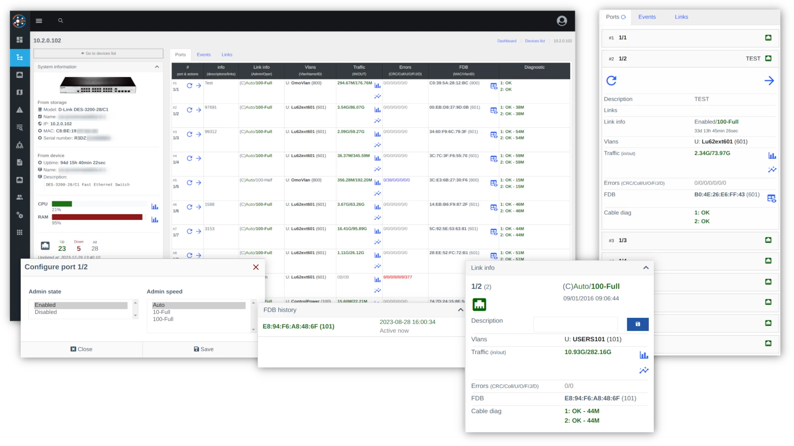
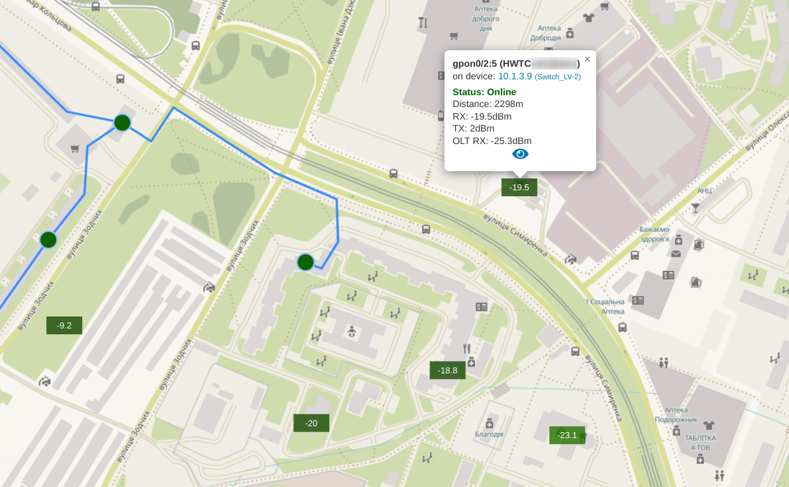

# Основні функції

 
#### Відображення Інформації та Стану Обладнання
За допомогою системи ви можете отримувати інформацію про обладнання як в реальному часі, так і отримувати історію різних метрик

- **Для OLT**
    - Доступність через SNMP та ICMP
    - CPU/RAM/Температура
    - Список портів
    - MAC/SN ONUs
    - Статус ONU
    - Таблиця FDB
    - Рівні сигналу
    - Список та статус Ethernet-портів на ONUs
    - Причини недоступності
    - Трафік
    - Помилки

- **Для Комутатора**
    - Доступність через SNMP та ICMP
    - CPU/RAM/Температура
    - Статус портів
    - Помилки
    - Трафік
    - Таблиця FDB
    - Діагностика кабелю (модуль DDM SFP)

 

#### Керування Обладнанням
У системі є певні елементи керування обладнанням, такі як: перезавантаження ONU, видалення ONU, зміна описів портів/ONU та керування портами (увімкнення/вимкнення).
Додатково, це дозволяє розширити керування самостійно за допомогою [макросів](../components/macros/getting-started.md).

!!! info
    Функціонал може варіюватися в залежності від типу обладнання, виробника та моделі.

### Адаптовано для Мобільних Пристроїв та Планшетів
Веб-інтерфейс системи побудований на основі [SPA](https://uk.wikipedia.org/wiki/Односторінкова_аплікація).
Інтерфейс працює без перезавантаження сторінки, що представляє собою повноцінну веб-додаток.
Таким чином, навіть з "повільним" Інтернетом, користувач може користуватися системою.

!!! tip
    Система дозволяє працювати як Прогресивна Веб-Додаток (PWA).
    Для його роботи системі потрібно працювати через HTTPS.
    Тут ви можете знайти інструкції з встановлення додатків [support.google.com](https://support.google.com/chrome/answer/9658361?hl=uk&co=GENIE.Platform%3DiOS).

### Події та Сповіщення
Використання запитів [Prometheus](https://prometheus.io/) та [PromQL](https://prometheus.io/docs/prometheus/latest/querying/basics/) дає можливість налаштування генерації подій. За замовчуванням генерація подій налаштована для виявлення відмови пристрою або інтерфейсу, збільшення кількості помилок та поганого сигналу.

Сповіщення можна налаштувати через Електронну пошту або Телеграм.    
Функція сповіщення системи забезпечує, що конкретний користувач отримує лише ті сповіщення, які йому потрібні.      
Наприклад, у разі відмови обладнання сповіщення отримують лише користувачі з доступом до цього обладнання.    

### Реєстрація нових ONUs
Система включає компонент для реєстрації ONUs, що дозволяє реєстрацію за допомогою заповнення простої форми.
Нереєстровані (нові) ONUs відображаються у віджеті на головній сторінці та на панелі управління пристроєм.

!!! tip
    Дізнайтеся більше про [реєстрацію ONUs](../components/onts-registration/getting-started.md)

!!! note
    Працює для OLTs Huawei та ZTE.

### Фоновий Збір Інформації з Обладнання
Фонові опитувачі збирають інформацію про FDB, статус портів/ONU, помилки, трафік та інше.
Ці дані використовуються для отримання історії інтерфейсу, побудови графіків та генерації сповіщень.

### Обладнання на мапі
Дозволяє встановлювати координати на мапі та бачити пристрої та ONTs на мапі
!!! note Деталь на мапах
    

### Гнучка Налаштування Прав Доступу для Користувачів
Завдяки розширеним налаштуванням прав доступу та ролей ви маєте можливість обмежити певні функції для користувачів.
Наприклад, ви можете заборонити техніку встановлювати або керувати PON портами чи перезапускати обладнання.
Додатково, обладнання розділено на групи, і є можливість обмежити видимість груп та обладнання для конкретного користувача.

### Збір Конфігурації Обладнання
Система використовує інструмент під назвою [Oxidized](https://github.com/ytti/oxidized) для збору конфігурації.
Ви можете переглядати поточну конфігурацію обладнання без прямого доступу до нього і також переглядати історію змін.

!!! tip       
    Якщо потрібно, конфігурацію можна зберігати в Git.

### Робота в Docker
Ми використовуємо [Docker](https://en.wikipedia.org/wiki/Docker).
Завдяки Docker вам більше не потрібно встановлювати програмне забезпечення певних версій, робити залежності та встановлювати необхідні бібліотеки.
Для встановлення системи все, що вам потрібно, - це завантажити та запустити утиліту [wca-tool](../wca-tool/index.md).
Утиліта встановить Docker та інше необхідне програмне забезпечення для роботи.

!!! tip
    **[wca-tool](../wca-tool/index.md)** - це спеціалізована утиліта для встановлення та оновлення системи
  

