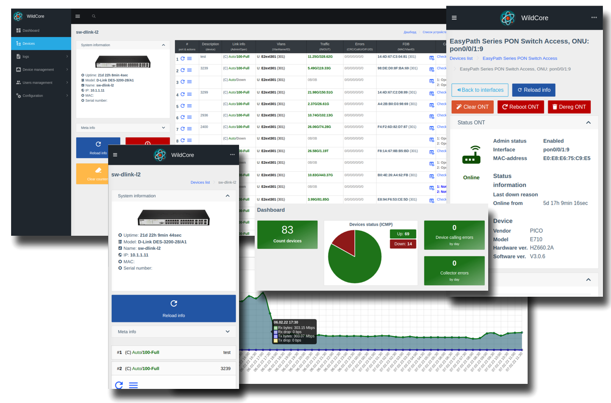

# **WildcoreDMS** - система моніторингу, діагностики та менеджменту пристроїв.

### Наша мета
Надати монтажнику/оператору зручний інструмент для діагностики мережі, обладнання та конкретного абонента,
тим самим:

- збільшити швидкість реакції на діагностику та вирішення проблем з мережею;
- Позбавити інженера необхідності вічно "сидіти на телефоні" і обробляти звернення від співробітників.

### Особливості системи
* Модульність - можливість підключати лише необхідні компоненти
* Робота в докер
* Легка установка та оновлення - за допомогою спеціальної утиліти встановлення та оновлення проводиться у декілька команд
* Легке налаштування системи - після встановлення потрібно тільки додати пристрої та користувачів
* Розширене налаштування ролей користувачів, доступу до обладнання та функціоналу - все для того, щоб надати співробітникам тільки необхідний функціонал
* Логування дій користувачів, роботи з обладнанням, роботи планувальника.
* Збір метрик в Prometheus
* API - інтегруйте wildcoreDMS з білінгом або іншими системами

### Компоненти системи
* **autodiscovery** - Пошук та автоматичне додавання підтримуваного обладнання в мережі
* **bdcom_olts** - Робота з ОЛТ від BDcom
* **c_data_interfaces** - Робота з ОЛТ від C-Data
* **dlink_switches** - Робота зі свитчами від Dlink
* **edgecore_switches** - Робота зі свитчами від Edge-Core
* **events** - Події. Дозволяє переглядати та зберігати історію з обладнання/інтерфейсів на основі створених правил promQL
* **fdb_history** - зберігає історію FDB і дозволяє відображати за інтерфейсом/ОНУ
* **huawei_olts** - Робота з ОЛТ від Huawei
* **huawei_switches** - Робота зі свитчами від Huawei
* **huawei_onts_registration** - Реєстрація ОНУек на Huawei
* **notifications** - Дозволяє надсилати повідомлення через телеграм/email за подіями та діями
**pinger** - Моніторить обладнання по ICMP, відображає поточний статус у дашборді та списку пристроїв.
* **prometheus_wrapper** - Працює з API прометеус. Дозволяє відображати графіки у веб-інтерфейсі з трафіку, рівня сигналу, температури, помилок
* **router_os** - Робота з роутерами від Mikrotik
* **switches** - компонент, який реалізовує стандартизований API для роботи зі свитчами
* **vsolution_olts** - Робота з ОЛТ від V-Sol
* **zte_olts** - Робота з ОЛТ від ZTE
* **zte_unregistered_onts** - Реєстрація ОНУшек на ZTE

_Всі вищеперелічені компоненти надаються разом із системою на момент бета-тестування_

### Підтримуване обладнання
* Dlink (світчі)
* Edge-Core (Світчі)
* Huawei (Світчі, ОЛТи)
* BDcom (ОЛТи)
* C-data (ОЛТи)
* V-Solution (ОЛТи)
* ZTE (ОЛТИ)
* Mikrotik (роутери)

Повний список обладнання, що підтримується за моделями - [https://github.com/meklis/switcher-core/blob/master/docs/DEVICES.md](https://github.com/meklis/switcher-core/blob/master /docs/DEVICES.md)
