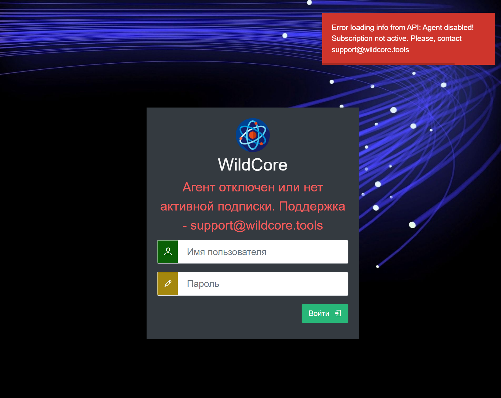

*На даний момент надається єдиний спосіб встановлення та роботи - всередині докер з установкою через wca-tool.*

## Встановлення
Виконайте команду
```shell
sudo wca-tool --key=YOUR_AGENT_KEY install
```
*YOUR_AGENT_KEY - ключ агента, який ви отримали при зверненні (див. вимоги)*
Процес установки займає деякий час (зазвичай 10-15 хвилин).

У разі успішного встановлення - буде відображено повідомлення
```shell
WildcoreDMS success installed!
Now, you can use wildcoreDMS URL: http://<service ip|domain>:8088
Default login/password - admin/admin

Ви можете змінити деякі параметри в /opt/wildcore-dms/.env file, as listen ports for example
```

Після інсталяції перейдіть до веб-панелі.
За замовчуванням панель доступна на порту `8088`, а дефотлний логін/пароль для входу – admin/admin.


## Часті проблеми при встановленні
### Не встановлений docker-compose-plugin
Зазвичай помилка виглядає так:


Потрібно, щоб система була встановлена ​​docker-compose як плагін до докеру, а не як окрема утиліта.

Щоб усунути проблему:

1. Встановіть пакет `docker-compose-plugin` для вашої ОС (дивіться інструкції встановлення в офіційній документації docker - [docs.docker.com](https://docs.docker.com/engine/install/))
2. Перевірте, що він дійсно працює – команда `docker compose version` повинна повертати версію плагіна.
3. Продовжте встановлення wildcoreDMS командою ```sudo wca-tool update```

### Агент вимкнено
Після успішного встановлення, при спробі входу - відображається повідомлення

Ця проблема може бути пов'язана з установкою системи на "слабкі" сервери (менше, ніж зазначено у рекомендаціях)
Вирішується так:

1. Чекаємо хвилин 5-10 (має запуститися СУБД. Можна також простежити за запуском командою `docker logs -f wca-db`)
2. Виконуємо команду `docker exec -it wca composer install`
3. Виконуємо команду `wca migration:migrate --up *:*`
   1. Якщо в процесі виконання команди отримали пов'язану із підключенням до БД (наприклад, Connection refused) – повертаємось до пункту 1.
4. Виконуємо команду `wca system:check`
5. Пробуємо повторно увійти через веб-інтерфейс


### Помилки пов'язані з мережею
Може проявлятися записами в логах типу: `Connection refused`, `Connection timeout`, `Forbidden`

Рекомендовані дії:

1. Прочитати з логів, куди саме робиться спроба підключитись
2. Упевниться що з сервера ця адреса доступна (перевірити тим же curl доступність у разі HTTP)
3. Якщо з відповіддю все добре – перевірити, що все добре з докером (встановлений за офіційною докою, не було старих версій та встановлена ​​версія саме під вашу систему)

Після усунення проблеми доустановку можна виконати командою `wca-tool update`.
