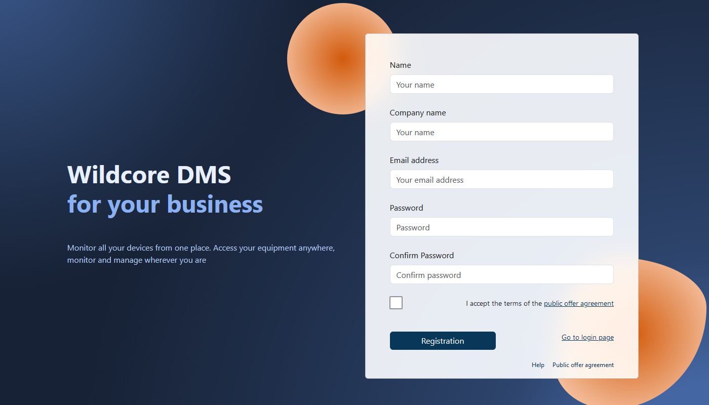
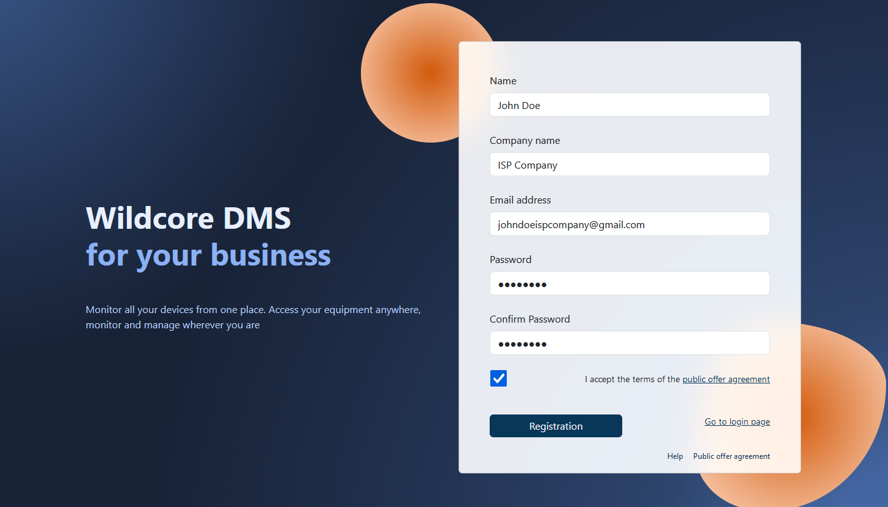
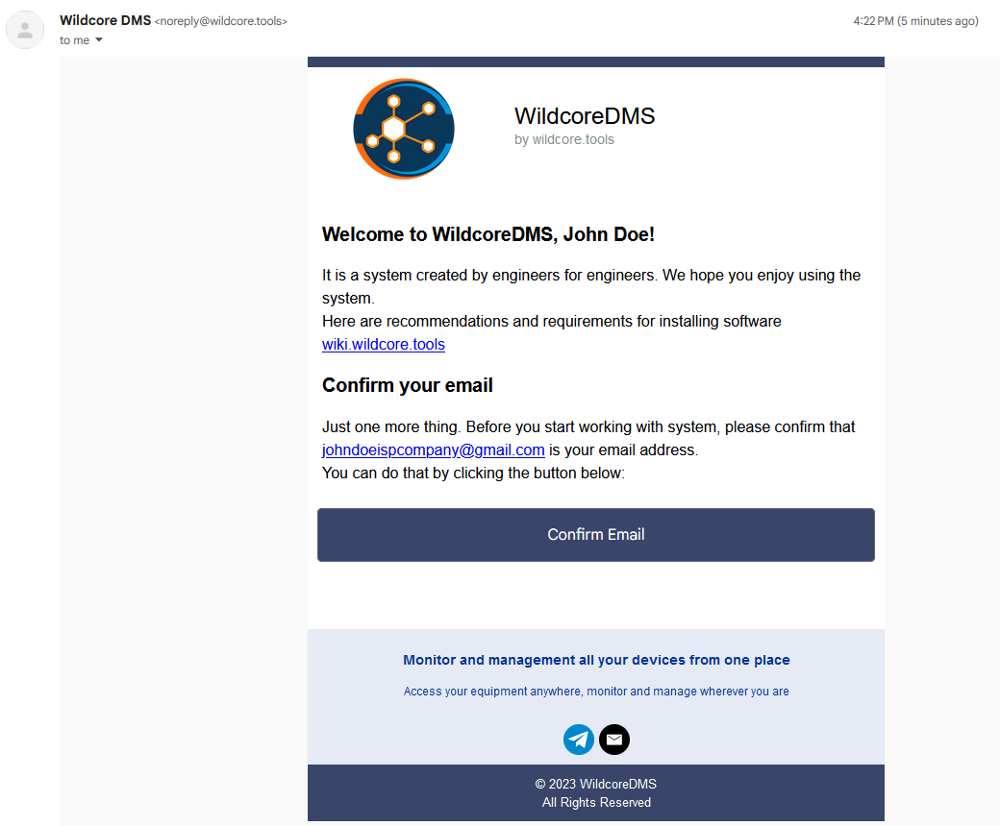
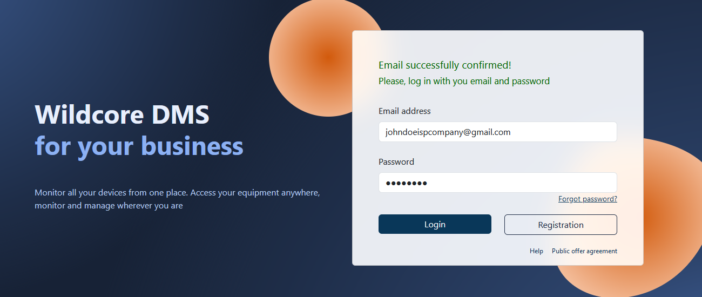
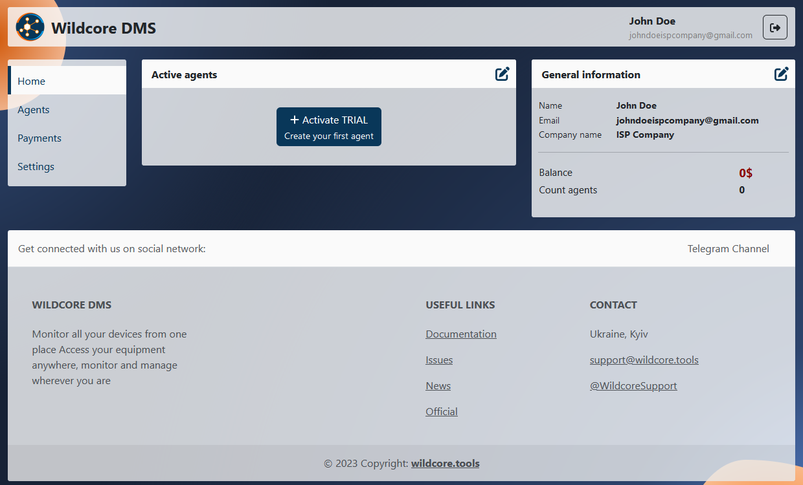
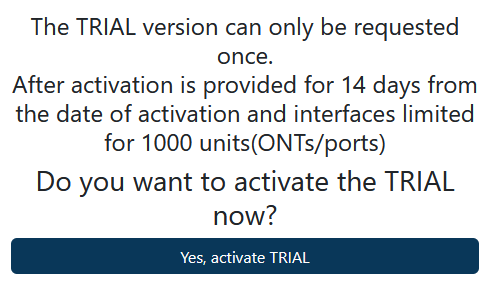
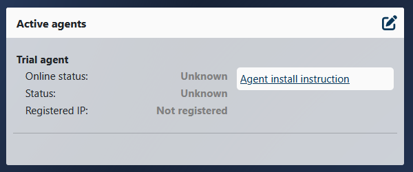
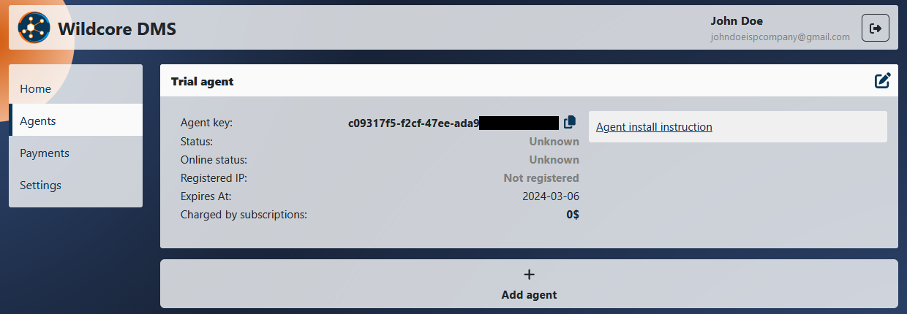
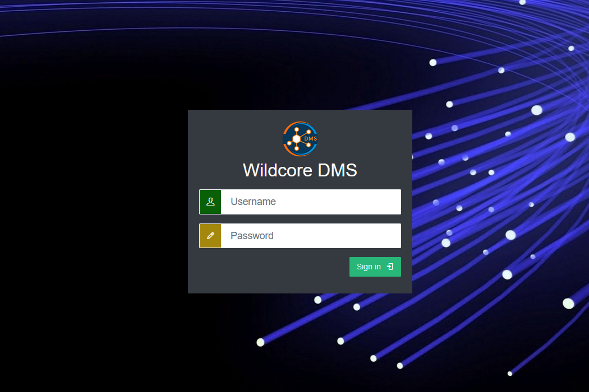

# Початок роботи

!!! abstract "Огляд"
    На цій сторінці надано опис процесу реєстрації та встановлення **WildcoreDMS**.

!!! warning "Примітка"
    На даний момент, єдина можливість встановити **WildcoreDMS** — через наш спеціальний застосунок `wca-tool`, використовуючи **Docker**.

!!! warning "Примітка"
    Перед встановленням, впевніться, що ваша система відповідає необхідним [Системним вимогам](./requirements.md).

## Реєстрація

!!! info "Інформація"
    Цей розділ проведе вас через процес реєстрації. Ви можете пропустити його, якщо у вас вже є аккаунт.

1. Перейдіть до [сторінки реєстрації](https://cabinet.wildcore.tools/auth/Registration).

    

2. Заповніть поля форми реєстрації, погодьтеся на [Правила та умови](https://wildcore.tools/public-offer-agreement.pdf) та натисніть кнопку **Registration**.

    

3. Підтвердіть вашу реєстрацію.

    Будь ласка, підтвердіть вашу реєстрацію, перевіривши електронну пошту, що ви вказали. Через кілька хвилин надійде лист з адреси `noreply@wildcore.tools` з посиланням на підтвердження.
    
    !!! tip "Підказка"
        Якщо виникла затримка з надходженням листа, перевірте папку **Спам**.

    Коли лист буде отримано, натисніть **Confirm Email** у ньому.

    

4. Тепер ви можете увійти до власного **Кабінету**, вказавши електронну адресу та пароль.

    

## Створення Агента

1. Увійдіть до свого персонального **Кабінету**.

    

2. Активуйте ваш **Пробний Агент**

    Натисніть кнопку **Activate TRIAL** у панелі **Active agents**, уважно прочитайте спливаюче віконце та погодьтеся з умовами.

    

    Ваш перший пробний **Агент** активовано.

    


## Встановлення

1. Встановіть останню версію `wca-tool`.

    ``` shell
    sudo curl -L "https://releases.wildcore.tools/wca-tool/latest/wca-tool-$(uname -s)-$(uname -m)" -o /usr/local/bin/wca-tool && sudo chmod +x /usr/local/bin/wca-tool
    ```

2. Знайдіть свій ключ Агента у вкладці **Agents** у вашому **Кабінеті**.

    

3. Виконайте наступну команду для встановлення **WildcoreDMS**.

    ``` shell
    sudo wca-tool --key=ВАШ_КЛЮЧ_АГЕНТА install 
    ```

!!! note "Примітка"
    Процесс встановлення може зайняти деякий час, зазвичай 10-15 хвилин.

Якщо встановлення пройшло успішно, буде виведено наступне повідомлення:

```
    WildcoreDMS (version x.xx.x) success installed!
    Now, you can use wildcoreDMS by URL: http://<service ip|domain>:8088
    Default login/password - admin/admin

    You can change some parameters in /opt/wildcore-dms/.env file, as listen ports for example
```

Після встановлення, ви можете перейти до **Веб-панелі**.

!!! tip "Підказка"
    За замовчуванням, панель доступна за адресою `http://localhost:8088`.

Вас привітає вікно входу до **WildcoreDMS**.



!!! tip "Підказка"
    Дані для входу за замовчуванням:

    - **Користувач:** `admin`
    - **Пароль:** `admin`


## Часті проблеми при встановленні

### Не встановлено docker-compose-plugin

Зазвичай, помилка виглядяє так:


!!! failure "Проблема:"
    `docker-compose` має бути встановлений на вашій системі як додаток для **Docker**, а не як окремий застосунок.

!!! success "Вирішення:"

    1. Встановіть пакет `docker-compose-plugin` для вашої операційної системи (зверніться до інструкції зі встановлення в офіційній [документації **Docker**](https://docs.docker.com/engine/install/))
    2. Перевірте, чи корректно він працює, виконавши команду `docker compose version`, яка повинна повернути версію додатка.
    3. Продовжуйте встановлення **WildcoreDMS** за допомогою команди `sudo wca-tool update`.
 

### Помилки, пов'язані з мережею
Такі помилки можуть проявлятися як записи у логах `Connection refused`,` Connection timeout`, або `Forbidden`.

!!! success "Вирішення:"

    1. Перевірте логи, щоб визначити спробу підключення, що викликала проблему.
    2. Підтвердіть існування адреси призначення на сервері (для НТТР ви можете використати ту саму `curl` команду).
    3. Якщо відповідь дійсна, перевірте ваші налаштування та встановлення **Docker**.

    Зверніться до офіційної [документації **Docker**](https://docs.docker.com/engine/install/) з приводу детальних інструкцій. Переконайтеся у сумісності з вашою версією операційної системи, відповідно до документації, або у відсутності застарілих версій.

Коли проблема вирішиться, ви можете продовжити встановлення за допомогою команди `wca-tool update`.

### Несправності веб-панелі або помилки команди `wca`

!!! success "Вирішення:"

    Використайте команду `docker ps -a`, щоб побачити запущені на даний момент контейнери.

    Продивіться логи контейнерів, що мають помилки командою `docker logs ...`.