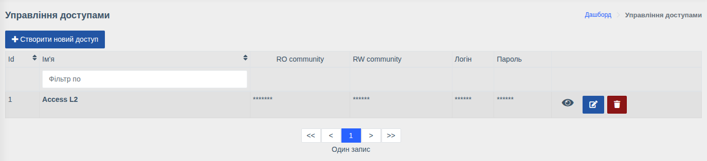
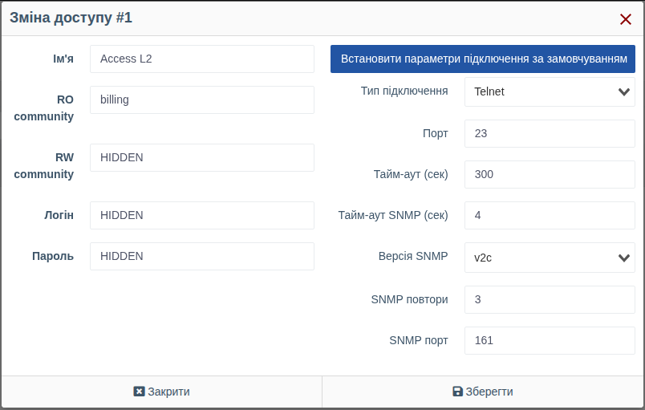

# Доступи до обладнання

!!! abstract "Огляд"

    **Доступ** — це набір облікових даних, з якими WildcoreDMS підключається до обладнання:
    SNMP community для читання та запису, логін і пароль для консолі (Telnet/SSH), а також
    за потреби — нестандартні порти та тайм-аути. Один доступ можна використовувати для
    будь-якої кількості пристроїв.

Меню: `Керування пристроями > Доступи`.

У списку секретні поля приховані зірочками. Кнопка з іконкою ока показує значення, кнопки
праворуч — редагування та видалення доступу.

## Створення та редагування

Натисніть **«Створити новий доступ»** або кнопку редагування біля наявного.

| Поле | Опис |
|------|------|
| **Ім'я** | Назва для вибору в картці пристрою, наприклад `Access L2` або `OLT Huawei` |
| **RO community** | SNMP community для читання (опитування, перегляд інформації) |
| **RW community** | SNMP community для запису — потрібне для дій через SNMP (зміна опису порту, увімкнення/вимкнення порту тощо) |
| **Логін** / **Пароль** | Облікові дані консолі (Telnet/SSH): використовуються для макросів, реєстрації ONU, веб-консолі та модулів, які працюють через консоль |

### Параметри підключення

За замовчуванням використовуються загальні параметри підключення системи
(*«Використовуються параметри підключень за замовчуванням»*). Щоб задати свої для цього
доступу, натисніть **«Встановити спеціальні параметри підключення»**:

| Поле | Опис |
|------|------|
| **Тип підключення** | `Telnet` або `SSH` — протокол консолі |
| **Порт** | Порт консолі (типово 23 для Telnet, 22 для SSH) |
| **Тайм-аут (сек)** | Максимальний час виконання консольної команди |
| **Тайм-аут SNMP (сек)** | Час очікування відповіді на один SNMP-запит |
| **Версія SNMP** | `v1` або `v2c` |
| **SNMP повтори** | Кількість повторів SNMP-запиту при відсутності відповіді |
| **SNMP порт** | Порт SNMP (типово 161) |

Кнопка **«Встановити параметри підключення за замовчуванням»** повертає загальні параметри.

!!! tip
    Якщо частина обладнання доступна за іншими портами або відповідає повільно (наприклад,
    OLT з великою кількістю ONU), створіть для нього окремий доступ зі збільшеними тайм-аутами.

!!! info "Права"
    Керування доступами потребує права **«Керування доступом до пристроїв»**.
    З консолі список доступів можна переглянути командою `wca device-access:list`.
