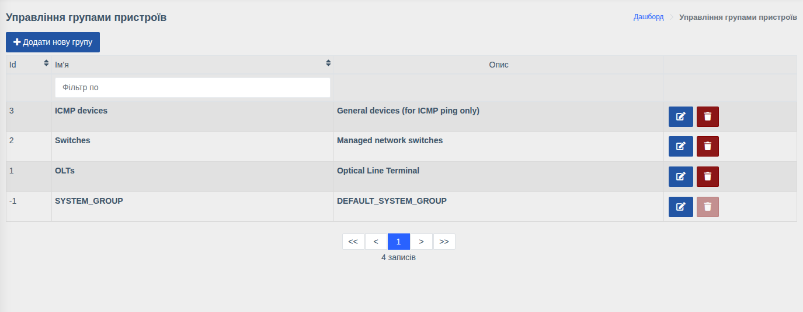

# Групи пристроїв

!!! abstract "Огляд"

    Групи об'єднують пристрої (наприклад, за районом, філією або типом обладнання) і
    визначають, **які пристрої бачить користувач**: кожен користувач бачить лише пристрої
    з груп, які йому призначено.

Меню: `Керування пристроями > Групи`.

## Створення групи

1. Натисніть **«Додати нову групу»**.
2. Вкажіть **Ім'я** та за бажанням **Опис**.
3. Збережіть.

Кнопки в рядку — редагування та видалення групи.

## Як групи впливають на доступ

- Пристрій може входити до кількох груп — поле **Групи** в [картці пристрою](./devices.md).
- Користувачу призначаються групи в полі **Групи пристроїв** його
  [облікового запису](./users.md).
- Користувач бачить у списках, пошуку, на карті, у подіях та сповіщеннях лише пристрої з
  призначених йому груп. Сповіщення про аварії також отримують лише користувачі з доступом
  до відповідного пристрою.
- Виняток — право **«Аналітика»**: воно показує інформацію про всі пристрої незалежно від груп,
  тому його варто надавати лише адміністраторам.

!!! note "Системна група"
    Група `SYSTEM_GROUP` створюється автоматично і не може бути видалена.

!!! tip "Приклад"
    Для монтажників району «Північ» створіть групу `North`, додайте до неї обладнання району та
    призначте її монтажникам. Обладнання інших районів вони не побачать.

!!! info "Права"
    Керування групами потребує права **«Керування групами пристроїв»**.
