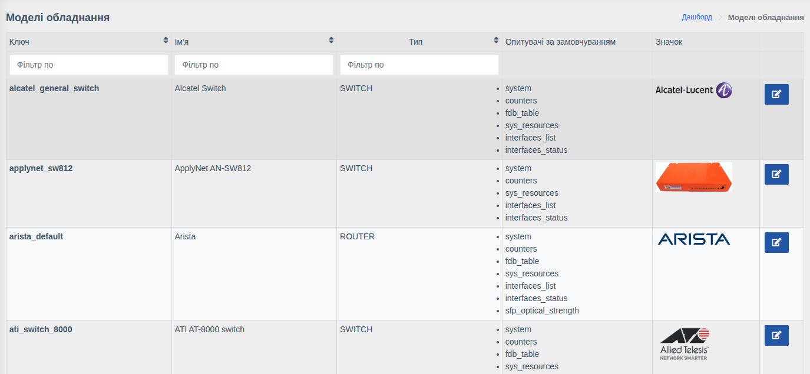
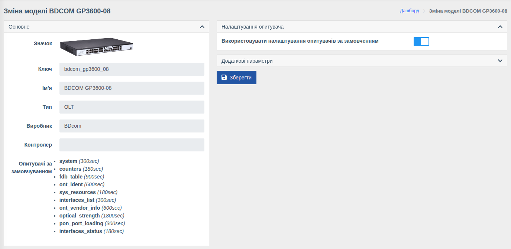

# Моделі обладнання

!!! abstract "Огляд"

    Модель визначає, як WildcoreDMS працює з пристроєм: яку інформацію можна отримати,
    які опитувачі запускаються та з якими інтервалами. Налаштування моделі застосовуються
    до всіх пристроїв цієї моделі (якщо в пристрої не задано власних).

Меню: `Керування пристроями > Моделі`.

Список моделей формується системою — підтримувані моделі додаються з оновленнями
WildcoreDMS (див. [Список обладнання](../supported-hardware.md)). У списку видно тип,
виробника та опитувачі моделі.

## Налаштування моделі

**Основне** — довідкова інформація, змінити її не можна:

| Поле | Опис |
|------|------|
| **Значок** | Зображення моделі |
| **Ключ** | Внутрішній ідентифікатор моделі |
| **Ім'я** | Назва моделі |
| **Тип** | `OLT`, `SWITCH`, `ROUTER` тощо |
| **Виробник** | Вендор обладнання |
| **Контролер** | Службове поле |
| **Опитувачі за замовчуванням** | Опитувачі та їх інтервали, задані для моделі |

**Налаштування опитувача** — вимкніть **«Використовувати налаштування опитувачів за
замовченням»**, щоб увімкнути/вимкнути окремі опитувачі або змінити їх інтервали для всієї
моделі. Детальніше — [Опитувач обладнання](../system/poller.md).

**Додаткові параметри** — JSON з параметрами роботи для всіх пристроїв моделі
(наприклад, [локальні описи PON](../system/working-with-hardware.md#pon)).
Параметри в картці пристрою мають пріоритет над параметрами моделі.

Після змін натисніть **«Зберегти»**.

!!! info "Права"
    Сторінка доступна з правом **«Керування пристроями»**.
