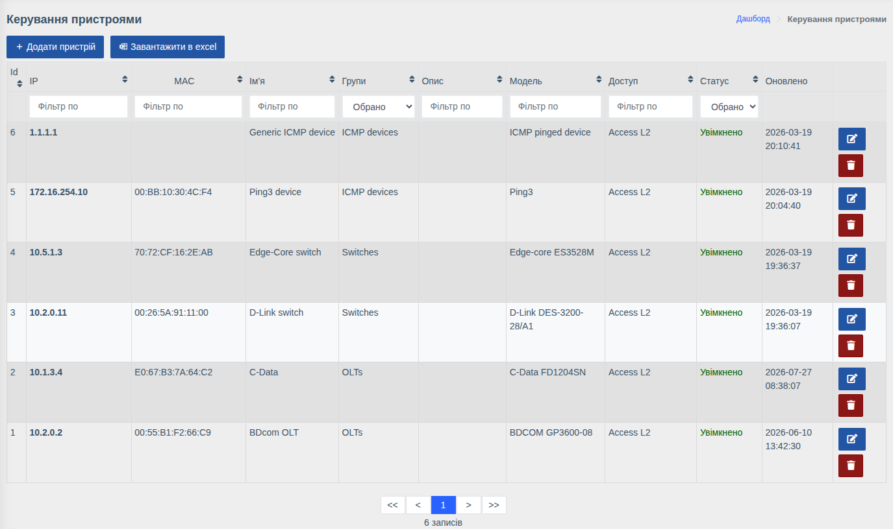
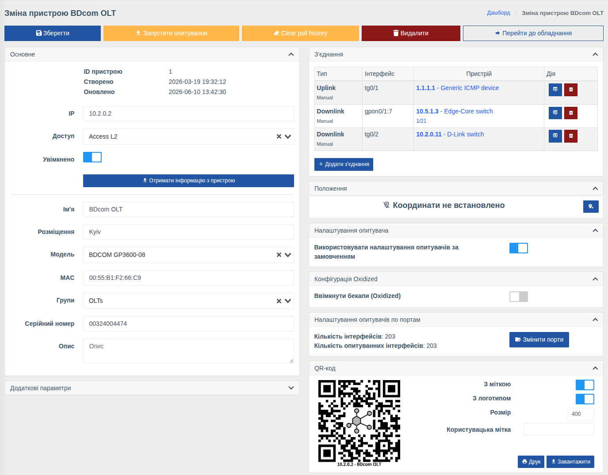

# Пристрої

!!! abstract "Огляд"

    Сторінка керування пристроями — це реєстр обладнання, з яким працює WildcoreDMS:
    додавання нових пристроїв, зміна їх параметрів, вимкнення та видалення.

Меню: `Керування пристроями > Пристрої`.

## Список пристроїв

Таблиця містить колонки **Id**, **IP**, **MAC**, **Ім'я**, **Групи**, **Опис**, **Модель**,
**Доступ**, **Статус** та **Оновлено**. Кожну колонку можна відфільтрувати (поле або список
під заголовком) та відсортувати натисканням на заголовок. Фільтр **Статус** дозволяє швидко
знайти вимкнені пристрої.

Кнопки в рядку — редагування та видалення пристрою.

## Додавання пристрою

1. Переконайтесь, що створено [доступ](./device-access.md) з правильними SNMP community.
2. Натисніть **«Додати пристрій»**.
3. Вкажіть **IP** та оберіть **Доступ**.
4. Натисніть **«Отримати інформацію з пристрою»** — WildcoreDMS опитає пристрій по SNMP і
   заповнить **Модель**, **Ім'я**, **Розміщення**, **MAC** та **Серійний номер**
   (в залежності від того, що віддає обладнання).
5. Оберіть **Групи**, за потреби змініть ім'я та опис.
6. Натисніть **«Створити»**.

!!! tip
    Якщо модель не визначилась автоматично, її можна обрати вручну зі списку.
    Масове додавання — через імпорт з CSV, див. [Імпорт пристроїв](../cli/import-devices.md).

## Редагування пристрою

### Кнопки дій

| Кнопка | Дія |
|--------|-----|
| **Зберегти** | Зберегти зміни |
| **Запустити опитування** | Запустити всі опитувачі пристрою у фоні, не чекаючи розкладу |
| **Clear poll history** | Очистити історію опитувань пристрою (з підтвердженням) |
| **Видалити** | Видалити пристрій разом з його інтерфейсами та історією |
| **Перейти до обладнання** | Відкрити сторінку пристрою (дашборд) |

### Основне

| Поле | Опис |
|------|------|
| **IP** | Адреса, за якою WildcoreDMS підключається до пристрою |
| **Доступ** | [Доступ](./device-access.md) з обліковими даними |
| **Увімкнено** | Вимкнений пристрій не опитується фоновими задачами, не бере участі в автотопології, але залишається в системі з усіма налаштуваннями |
| **Ім'я** | Назва пристрою у списках, пошуку, на карті |
| **Розміщення** | Адреса або місце встановлення |
| **Модель** | [Модель обладнання](./device-models.md) — визначає, як WildcoreDMS працює з пристроєм |
| **MAC**, **Серійний номер** | Ідентифікатори пристрою |
| **Групи** | [Групи пристроїв](./device-groups.md) — від них залежить, хто з користувачів бачить пристрій |
| **Опис** | Довільний коментар |

### Інші блоки

- **Додаткові параметри** — JSON з параметрами роботи, що перевизначають параметри моделі.
  Приклад використання — [Локальні описи PON](../system/working-with-hardware.md#pon).
- **З'єднання** — зв'язки пристрою з іншими (uplink/downlink). Детальніше —
  [З'єднання](../components/links/describe.md).
- **Положення** — координати пристрою на карті: кнопка з міткою дозволяє вказати точку на карті.
- **Налаштування опитувача** — власні інтервали опитувачів для цього пристрою замість
  налаштувань моделі, див. [Опитувач обладнання](../system/poller.md).
- **Конфігурація Oxidized** — увімкнення резервного копіювання конфігурації пристрою
  (якщо встановлено компонент [Бекапи конфігурації](../components/oxidized.md)).
- **Налаштування опитувачів по портам** — кількість інтерфейсів і скільки з них опитується;
  кнопка **«Змінити порти»** дозволяє вимкнути збереження метрик для окремих портів
  (див. [Опитувач обладнання](../system/poller.md)).
- **QR-код** — генерація наліпки з посиланням на пристрій, див.
  [Генератор QR кодів](../components/qr-code-generator.md).

!!! info "Права"
    Сторінка доступна з правом **«Керування пристроями»**. Запуск опитування з картки —
    право **«Запуск опитувальника для пристрою»**.
