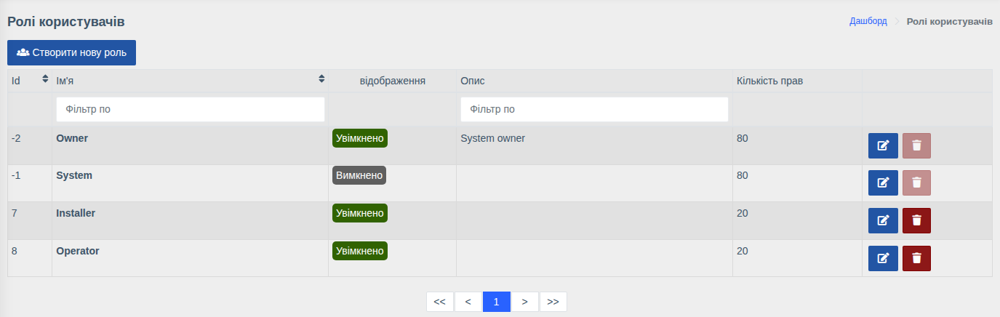
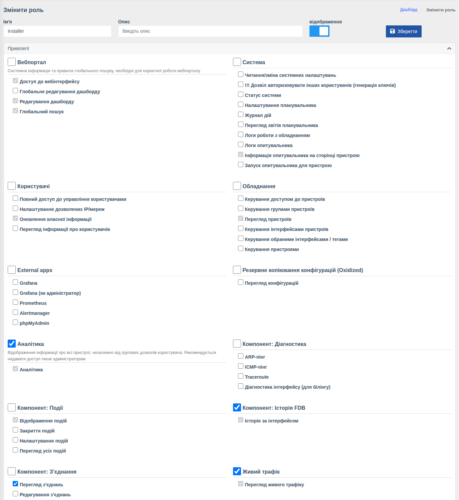

# Ролі та права

!!! abstract "Огляд"

    Роль — це набір прав (привілеїв), що визначає, які розділи бачить користувач і які дії
    може виконувати. Кожному користувачу призначається одна роль. Які саме **пристрої**
    він бачить — визначають [групи пристроїв](./device-groups.md).

Меню: `Користувачі > Ролі`.

У списку показано назву, опис, ознаку відображення та **кількість прав** кожної ролі.

## Вбудовані ролі

| Роль | Опис |
|------|------|
| **Owner** | Власник системи — має всі права. Не редагується та не видаляється |
| **System** | Службова роль системи, прихована (не відображається у виборі) |

Решту ролей (наприклад, «Оператор», «Монтажник») ви створюєте самі.

## Створення та редагування ролі

Натисніть **«Створити нову роль»** або кнопку редагування біля наявної.

| Поле | Опис |
|------|------|
| **Ім'я** | Назва ролі |
| **Опис** | Довільний коментар |
| **Відображення** | Чи показувати роль у списку вибору при призначенні користувачу |
| **Зіставлення груп SSO** | Показується, якщо увімкнено вхід через SSO. Див. [Вхід через SSO → Ролі](../sso/index.md#roles) |

Нижче — блок **Привілеї**: права згруповані за розділами. Позначка біля назви групи вмикає
або вимикає всі права групи одразу. Сірі (неактивні) позначки — базові права, які є у кожної
ролі. Після змін натисніть **«Зберегти»**.

## Групи прав

Набір груп залежить від встановлених компонентів. Основні:

| Група | Що дозволяє |
|-------|-------------|
| **Вебпортал** | Доступ до вебінтерфейсу, редагування дашборду (власного та глобального), глобальний пошук |
| **Система** | Системні налаштування, статус системи, планувальник та його звіти, журнал дій, логи роботи з обладнанням та опитувача, запуск опитувача. Право **«Дозвіл авторизовувати інших користувачів»** — лише для адміністраторів |
| **Користувачі** | Керування користувачами, налаштування дозволених IP, оновлення власної інформації, перегляд користувачів |
| **Обладнання** | Перегляд пристроїв, керування пристроями, доступами, групами, інтерфейсами, обраними інтерфейсами/тегами |
| **External apps** | Доступ до Grafana (також як адміністратор), Prometheus, Alertmanager, phpMyAdmin |
| **Аналітика** | Розділ аналітики — **по всіх пристроях незалежно від груп** |
| **OLT'и** | Інформація з OLT; дії з ONU: скасування реєстрації, перезавантаження, очищення лічильників, скидання, увімкнення/вимкнення, опис; керування фізичними та UNI-портами; реєстрація ONU та її налаштування |
| **Комутатори** | Інформація з комутаторів; перезавантаження, збереження конфігурації, очищення лічильників; опис, стан і швидкість порту; VLAN на портах |
| **Компонент: Події** | Перегляд, закриття та налаштування подій, перегляд усіх подій |
| **Компонент: Сповіщення** | Повний доступ, налаштування контактів (власних та інших), глобальні сповіщення |
| **Компонент: Макроси** | Запуск та редагування макросів |
| **Компонент: З'єднання** | Перегляд та редагування з'єднань |
| **Компонент: Діагностика** | ARP-пінг, ICMP-пінг, Traceroute, діагностика інтерфейсу для білінгу |
| **Компонент: Історія FDB**, **Пошук пристроїв** | Історія FDB за інтерфейсом та пошук в ній; пошук за MAC/IP |
| **Компонент: Prometheus** | Графіки: оптична історія, трафік тощо |
| **Живий трафік** | Перегляд трафіку в реальному часі |
| **Резервне копіювання (Oxidized)** | Перегляд збережених конфігурацій |
| **Вкладення**, **Генератор QR**, **Датчики**, **RouterOS**, **Веб-консоль** | Права відповідних компонентів |

## Приклади ролей

| Роль | Рекомендовані права |
|------|---------------------|
| **Оператор підтримки** | Вебпортал, Перегляд пристроїв, Інформація з OLT/комутаторів, Діаграми, Відображення подій, Діагностика, Пошук пристроїв |
| **Монтажник** | Як оператор + Реєстрація ONU, Перезавантаження ONU, Редагування опису ONU, Запуск макросів |
| **Старший інженер** | Як монтажник + Керування портами, VLAN на портах, Керування інтерфейсами, Редагування з'єднань, Закриття подій, Веб-консоль |
| **Адміністратор** | Усі групи, включно з Системою, Користувачами та Обладнанням |

!!! tip
    Під час входу через SSO роль може призначатися автоматично за групами провайдера —
    див. [Вхід через SSO](../sso/index.md#roles).
