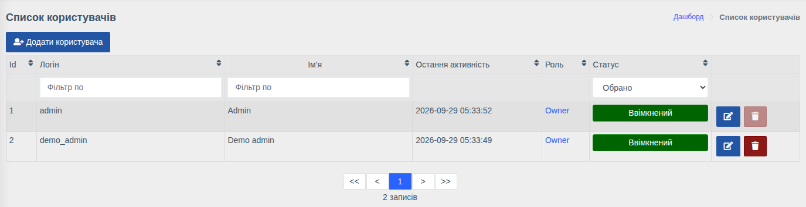
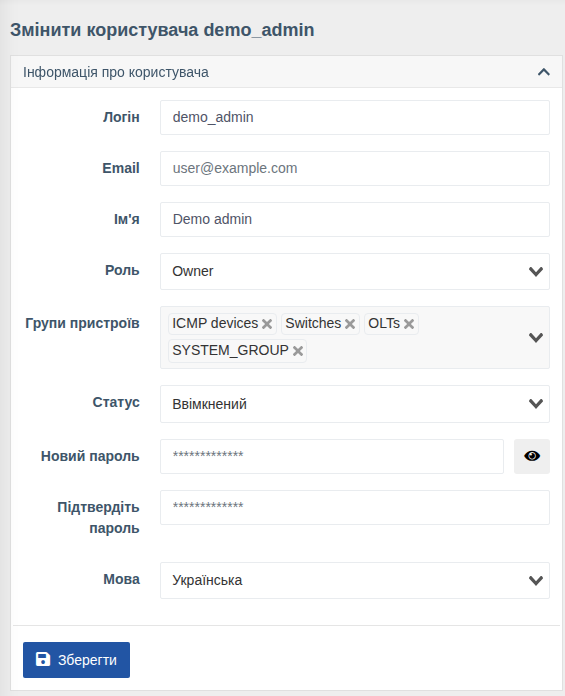

# Користувачі

!!! abstract "Огляд"

    Керування обліковими записами співробітників: створення, призначення ролі та груп
    пристроїв, блокування, зміна пароля.

Меню: `Користувачі > Користувачі`.



У списку видно логін, ім'я, **останню активність**, роль та статус. Список можна фільтрувати
за логіном, ім'ям та статусом.

## Створення та редагування

Натисніть **«Додати користувача»** або кнопку редагування біля наявного.



| Поле | Опис |
|------|------|
| **Логін** | Ім'я для входу |
| **Email** | Використовується для прив'язки до [SSO](../sso/index.md) та як контакт |
| **Ім'я** | Відображуване ім'я співробітника |
| **Роль** | [Роль](./roles.md) — набір прав користувача |
| **Групи пристроїв** | [Групи](./device-groups.md), пристрої яких бачить користувач |
| **Статус** | `Ввімкнений` / `Вимкнений`. Вимкнений користувач не може увійти (зокрема через SSO), але його дані та історія дій зберігаються |
| **Новий пароль** / **Підтвердіть пароль** | Задати або змінити пароль. При редагуванні можна залишити порожнім — пароль не зміниться. Якщо в системі увімкнено перевірку складності, пароль має містити щонайменше 8 символів, великі та малі літери, цифру та спецсимвол |
| **Мова** | Мова веб-інтерфейсу користувача |

Натисніть **«Зберегти»** (або **«Створити»** для нового користувача).

## Інші блоки картки

На сторінці користувача адміністратор також може керувати тим самим, що користувач бачить у
своїх [Параметрах аккаунту](../web-interface/user-settings-overview.md):

- **Налаштування повідомлень** — контакти для [сповіщень](../components/notifications.md);
- **Обмеження входу по IP** — дозволені адреси/мережі для входу;
- **Активні сесії** — перегляд та закриття сесій, створення
  [API-ключа](../web-interface/api-key-generation.md);
- **Налаштування порталу** та **Видимість карток інтерфейсу** — персональні налаштування
  інтерфейсу користувача;
- **2FA** — відключення двофакторної автентифікації, якщо користувач втратив доступ до
  застосунку-автентифікатора.

## Корисні команди

```bash
wca user:list                              # список користувачів
wca user:change-role <login> [role]        # змінити роль
wca user:reset-password <login>            # задати новий пароль
wca user:reset-ip-strict <login>           # скинути обмеження входу по IP
wca user:reset-user <login>                # скинути пароль (стане рівним логіну), 2FA та обмеження по IP
```

!!! info "Права"
    Керування користувачами — право **«Повний доступ до управління користувачами»**.
    Перегляд списку без змін — **«Перегляд інформації про користувачів»**.
