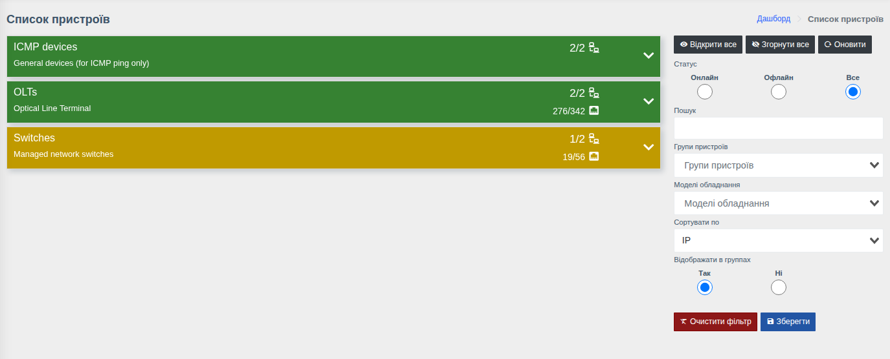
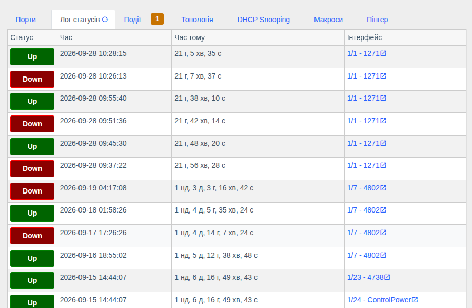

# Список пристроїв і сторінка пристрою

!!! abstract "Огляд"

    Як знайти пристрій, що показує його сторінка незалежно від типу обладнання, та які блоки
    є на сторінці будь-якого порту чи ONU. Особливості окремих типів — на сторінках
    [OLT](./olt.md), [ONU](./onu.md), [Комутатори](./switches.md),
    [Mikrotik RouterOS](./routeros.md), [ICMP-пристрої](./icmp-devices.md).

## Список пристроїв

Меню **«Пристрої»** (іконка дерева в боковому меню).

Пристрої згруповані за [групами](../management/device-groups.md). На плашці групи видно:

- кількість доступних пристроїв з усіх (`2/2`);
- для OLT — кількість ONU онлайн з усіх (`276/342`);
- колір плашки показує стан групи: зелений — усе доступно, інші кольори — є недоступні пристрої або ONU.

Розгорніть групу, щоб побачити пристрої. Панель праворуч:

| Елемент | Призначення |
|---------|-------------|
| **Відкрити все / Згорнути все** | Розгорнути або згорнути всі групи |
| **Статус** | Показати лише онлайн, лише офлайн або всі пристрої |
| **Пошук** | Фільтр за IP, назвою, описом |
| **Групи пристроїв**, **Моделі обладнання** | Фільтр за групами та моделями |
| **Сортувати по** | Порядок пристроїв у групі |
| **Відображати в групах** | Показувати з групами або одним списком |
| **Зберегти** | Запам'ятати налаштування фільтра для себе |

Знайти пристрій, порт або ONU також можна через **глобальний пошук** (іконка лупи вгорі) — за IP,
назвою, описом, договором, серійним номером/MAC ONU або тегом (`#тег`).

## Сторінка пристрою

Ліва панель однакова для всіх типів обладнання:

**Інформація про пристрій**

- **Зі складу** — дані, збережені в системі: модель, ім'я, IP, MAC, серійний номер;
- **З пристрою** — дані, отримані з обладнання: аптайм, системне ім'я та опис, версії ПЗ;
- **CPU / RAM / температура** — поточне завантаження; значок графіка відкриває історію;
- для OLT та комутаторів — кількість ONU/портів **онлайн / офлайн / всього** та час оновлення;
- кнопки швидкого доступу:

| Кнопка | Дія |
|--------|-----|
| **Змінити** | Відкрити [картку пристрою](../management/devices.md) в керуванні |
| **Web** | Відкрити веб-інтерфейс обладнання (`http://<IP>`) |
| **SSH** / **Telnet** | Відкрити підключення в SSH/Telnet-клієнті вашого комп'ютера |
| **Консоль**, **Консоль (автовхід)** | Відкрити [веб-консоль](../components/console.md) у браузері (якщо компонент увімкнено і є права) |
| Значок QR | Згенерувати [QR-код](../components/qr-code-generator.md) пристрою |

**Інші блоки лівої панелі**

- **Виклик пристрою** — звідки взято кожен тип даних: з кешу (і коли) чи онлайн з обладнання;
- **Опитувачі** — історія автоматичних опитувань пристрою: коли запускались і чи успішно;
- **Підтримувані модулі** — що система вміє отримувати з цієї моделі;
- **Оновити** — запитати свіжі дані з обладнання (15–30 с і довше для великих OLT).

Праворуч — вкладки, набір яких залежить від типу обладнання.

## Загальні вкладки { #tabs }

| Вкладка | Що показує | Коли доступна |
|---------|------------|---------------|
| **Події** | Відкриті та закриті [події](../components/events.md) по пристрою; число на вкладці — кількість відкритих | Є право на перегляд подій |
| **Макроси** | Запуск [макросів](../components/macros/getting-started.md) на пристрої | Компонент «Макроси» і право запуску |
| **Лог статусів** | Історія змін стану портів/ONU: Up/Down, час, скільки часу тому, інтерфейс з посиланням | Завжди |
| **Вкладення** | Фото та документи до пристрою — [Вкладення](../components/attachments.md) | Компонент «Вкладення» |
| **Топологія** | Висхідна топологія (ланцюжок аплінків до ядра) та [з'єднання](../components/links/describe.md) пристрою | Компонент «З'єднання» |
| **Бекапи** | Збережена конфігурація та статус останнього бекапу — [Бекапи конфігурації](../components/oxidized.md) | Компонент увімкнено і для пристрою ввімкнено бекапи |
| **Пінгер** | Доступність по ICMP — див. [ICMP-пристрої та Пінгер](./icmp-devices.md#pinger) | Завжди |
| **DHCP Snooping** | [Прив'язки MAC/IP/VLAN](./dhcp-snooping.md) | Модель підтримує |

## Сторінка порту або ONU { #interface }

Відкривається з таблиці портів, дерева ONU, пошуку або посилань в інших місцях. Угорі — кнопки
дій (набір залежить від типу інтерфейсу та ваших прав), нижче — картки.

Загальні картки для порту комутатора, фізичного порту OLT, PON-порту та ONU:

| Картка | Що показує |
|--------|------------|
| **Пристрій** | До якого пристрою належить інтерфейс (стрілка — повернутися на сторінку пристрою) |
| **Відмітки інтерфейса** | **Обране** (зірочка) та **теги** — для швидкого пошуку й групування. Обрані інтерфейси доступні в `Інтерфейси > Обрані`, по них також генеруються події |
| **Інформація про зберігання** | Коли інтерфейс з'явився в системі, внутрішній ID, **Опитування ввімкнено** (чи опитувати інтерфейс за розкладом), **Зберігати FDB в історію**, коментар |
| **Инфо з біллінгу** | Дані абонента з підключеного білінгу ([MikBill](../components/mikbill_integration.md), [NoDeny Plus](../components/nodeny_plus.md), [Userside](../components/us_integration.md)): договір, логін, адреса, статус, посилання в білінг |
| **Таблиця аптайму** | Історія Up/Down інтерфейсу: коли піднявся, коли впав, скільки був у роботі, причина падіння |
| **FDB таблиця** | MAC-адреси, які зараз бачить пристрій на інтерфейсі (VLAN, тип запису) |
| **FDB історія** | На якому інтерфейсі й у який час була кожна MAC-адреса; «активно зараз» — MAC присутній і тепер |
| **Висхідна топологія** | Ланцюжок пристроїв від цього інтерфейсу до ядра мережі з завантаженням аплінків |
| **Виклик пристрою** | Джерело даних по кожному модулю (кеш/онлайн) |
| **Події** | Події по цьому інтерфейсу |
| **З'єднання** | Зв'язки з іншими пристроями, кнопка **Додати з'єднання** |
| **Положення** | Координати на карті — вказати на карті або геолокацією телефону |
| **QR-код** | Наліпка з посиланням на цей інтерфейс |

!!! tip "Приховати зайві картки"
    Кнопка з іконкою ока в правому верхньому куті сторінки (**«Керування картками інтерфейсу»**)
    дозволяє вимкнути картки, які вам не потрібні. Налаштування зберігається у вашому обліковому
    записі і також доступне в `Параметри аккаунту` → **«Видимість карток інтерфейсу»**.

Біля назви кожної картки є значок **«?»** з поясненням — див. [Підказки](../web-interface/theme.md#hints).
