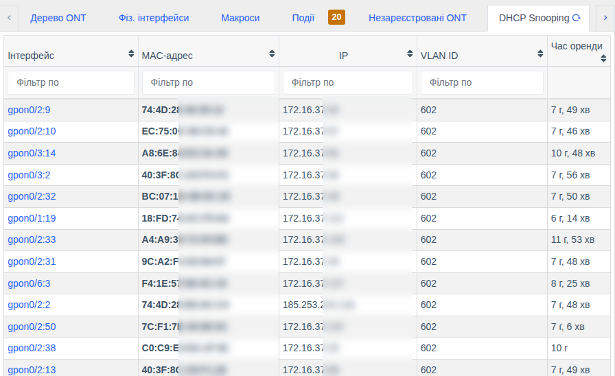
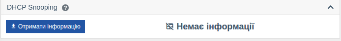

# DHCP Snooping

!!! abstract "Огляд"

    Починаючи з версії **0.31** WildcoreDMS показує таблицю прив'язок **DHCP Snooping** з
    комутаторів та OLT: який MAC-адресі абонента видано яку IP-адресу, у якому VLAN, на якому
    порту/ONU і скільки ще діє оренда. Це дозволяє швидко знайти абонента за IP або перевірити,
    чи отримує його обладнання адресу.

## Де переглянути

| Місце | Що показується |
|-------|----------------|
| Сторінка комутатора → вкладка **DHCP Snooping** | Усі прив'язки пристрою |
| Сторінка OLT → вкладка **DHCP Snooping** | Усі прив'язки OLT з прив'язкою до конкретних ONU |
| Сторінка порту комутатора → картка **DHCP Snooping** | Прив'язки на цьому порту |
| Сторінка ONU → картка **DHCP Snooping** | Прив'язки за цією ONU |

Вкладка та картки показуються лише для моделей, які підтримують цю функцію.

Таблиця містить **Інтерфейс** (порт або ONU — з посиланням на його сторінку), **MAC-адресу**,
**IP**, **VLAN ID** та **час оренди**, що залишився. Колонки можна фільтрувати та сортувати.
Кнопка оновлення на вкладці запитує свіжі дані з обладнання.

### Картка ONU

На сторінці ONU дані запитуються кнопкою **«Отримати інформацію»** (або **«Оновити інформацію»**,
якщо дані вже є): на частині моделей прив'язки до ONU визначаються через таблицю FDB, і це
може тривати кілька секунд.

Щоб таблиця завантажувалась автоматично разом з іншою інформацією про ONU, увімкніть для
пристрою або моделі параметр [`load_snooping_info`](../management/custom-parameters.md#load_snooping_info).

!!! tip
    Показ картки можна вимкнути для себе в `Параметри аккаунту` → **Видимість карток інтерфейсу**.

## Підтримуване обладнання

| Виробник | Моделі | Примітки |
|----------|--------|----------|
| **D-Link** | DES-3200, DES-30xx, DES-1228/ME, DGS-3000, DGS-3100, DGS-3120, DGS-3420 | Також показується режим DHCP relay. Серія DGS-1100/1210 не підтримується (обладнання не віддає ці дані) |
| **BDcom** | EPON/GPON OLT, зокрема P3608B, GP3600 | Дані по SNMP, якщо прошивка не підтримує — через консоль. Точна прив'язка до ONU |
| **C-Data** | FD-EPON, FD11xx, FD16xxV3, FD17xxV3 | Прив'язка до ONU (за номером ONU або через FDB) |

## Права

Перегляд доступний користувачам з правом перегляду інформації з обладнання
(**«Інформація з комутаторів»** / **«Інформація з OLT»**) — див. [Ролі та права](../management/roles.md).
