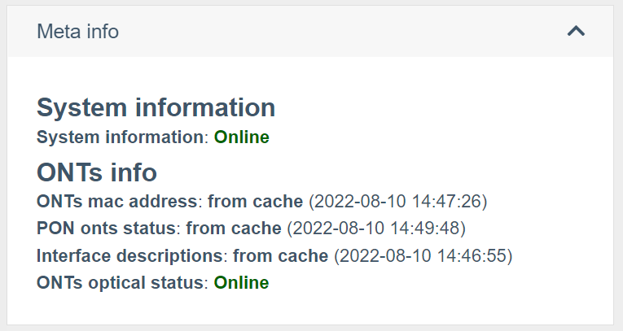

# Робота з обладнанням

## Взаємодія з обладнанням
Система wildcore може взаємодіяти з обладнанням через **snmp версії 2c**,
через **консоль**(ssh/telnet), а також через **API** (для RouterOS).
     
У доступі до обладнання можна вказати порти, якщо у вашій мережі використовуються нестандартні порти


## Налаштування параметрів роботи з обладнанням

## Опитування обладнання
### Отримання стандартизованого виводу через модулі switcher-core
Будь-яка взаємодія із системою здійснюється викликом певних модулів switcher-core.
Кожен вендор і модель мають свій набір модулів.
Список підтримуваних модулів з обладнання можна отримати командою
````
wca switcher-core:modules DEVICE_IP
````

### Виведення інформації у веб-інтерфейсі
Система спрямована на відображення "живої" інформації з обладнання.
     
Але, враховуючи, що потрібна прийнятна швидкість завантаження сторінок - пішли на компроміс у вигляді кешування відповідей.
Щоб переглянути, яка інформація була отримана з кешу системи, а яка з обладнання - розгорніть блок "Meta info" (Статус-інфо) на сторінці обладнання з інтерфейсами / в ОНУ.

На скріншоті вище відображається назва модуля, а також джерело, звідки дані отримані:

* **from cache (ДАТА)** - дані отримані з кешу, а ДАТА говорить про дату додавання цих даних у кеш
* **online** - дані отримані з обладнання.

Якщо вам необхідно отримати "живі" дані – натисніть кнопку "Reload info" (оновлення сторінки може зайняти деякий час. Зазвичай 15-30 секунд)
     
Також варто враховувати, що частина даних може відображатися з Prometheus (наприклад, рівні сигналів) і кнопка Reload info не призведе до оновлення цієї інформації.
_Детальніше, про те, які дані та на якому обладнанні беруться з Prometheus дивіться в описі компонентів, за потрібним типом обладнання_

## Глобальні налаштування

