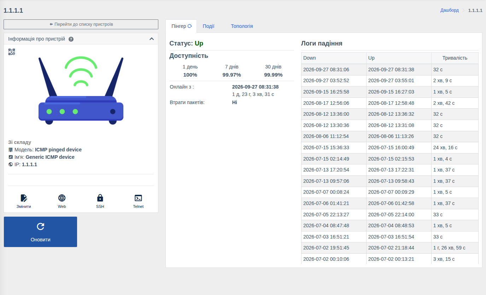
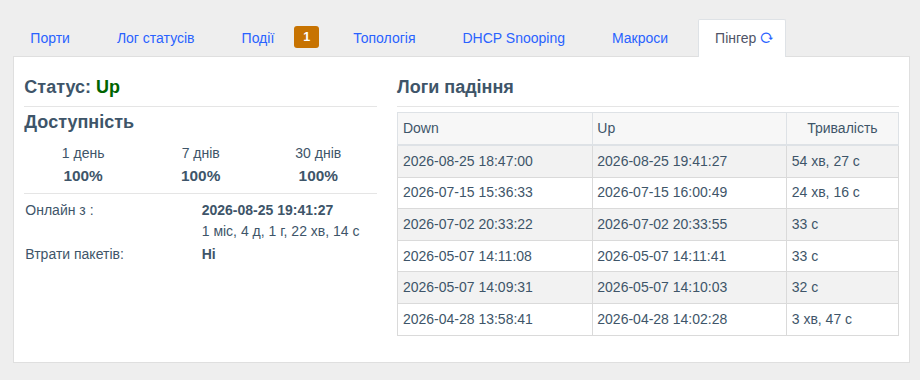

# ICMP-пристрої та Пінгер

!!! abstract "Огляд"

    **Пінгер** стежить за доступністю будь-якого пристрою по ICMP (ping) і рахує відсоток
    доступності та історію падінь. **ICMP-пристрої** — окремий тип пристроїв для вузлів, з якими
    WildcoreDMS не працює по SNMP: сервери, камери, абонентські роутери, точки доступу тощо.

!!! info "Компонент"
    [Пінгер](../components/pinger.md) (`pinger`).

## ICMP-пристрої

Щоб контролювати доступність будь-якого вузла:

1. `Керування пристроями > Пристрої` → **«Додати пристрій»**.
2. Вкажіть **IP** та будь-який **доступ** (для ICMP облікові дані не використовуються).
3. Модель оберіть вручну: **ICMP pinged device** (кнопка «Отримати інформацію з пристрою» не
   потрібна). Для пристроїв Ping3 оберіть відповідну модель.
4. Збережіть.

На сторінці ICMP-пристрою доступні вкладки **Пінгер**, **Події** та **Топологія**. Такий пристрій
можна додати на карту, пов'язати з'єднаннями з іншим обладнанням (наприклад, як downlink комутатора)
і отримувати [сповіщення](../components/notifications.md) про його недоступність.

## Вкладка «Пінгер» { #pinger }

Вкладка є на сторінці будь-якого пристрою:

| Показник | Опис |
|----------|------|
| **Статус** | Поточний стан: Up / Down |
| **Доступність** | Відсоток часу, коли пристрій був доступний, за **1 день**, **7 днів** та **30 днів** |
| **Онлайн з / Офлайн з** | Коли пристрій востаннє змінив стан і скільки часу в поточному стані |
| **Втрати пакетів** | Чи фіксуються втрати пакетів |
| **Логи падіння** | Кожне падіння: коли впав (Down), коли піднявся (Up), тривалість |

## Як це працює

- Доступність перевіряється фоновим сервісом постійно для всіх увімкнених пристроїв.
- Недоступність пристрою по ICMP створює [подію](../components/events.md) «пристрій недоступний», за якою
  надсилаються сповіщення.
- Перед зверненням до обладнання по SNMP/консолі WildcoreDMS перевіряє його доступність пінгом —
  щоб одразу показати «недоступний» замість очікування тайм-ауту (параметр `SWC_CHECK_ICMP_PING`,
  див. [Налаштування системи](../installation-and-updating/env-configuration.md#swc)).
- [Вимкнені](../management/devices.md) пристрої не перевіряються.

!!! tip
    Мережевий фаєрвол між сервером WildcoreDMS та обладнанням має пропускати ICMP echo-request/reply.
