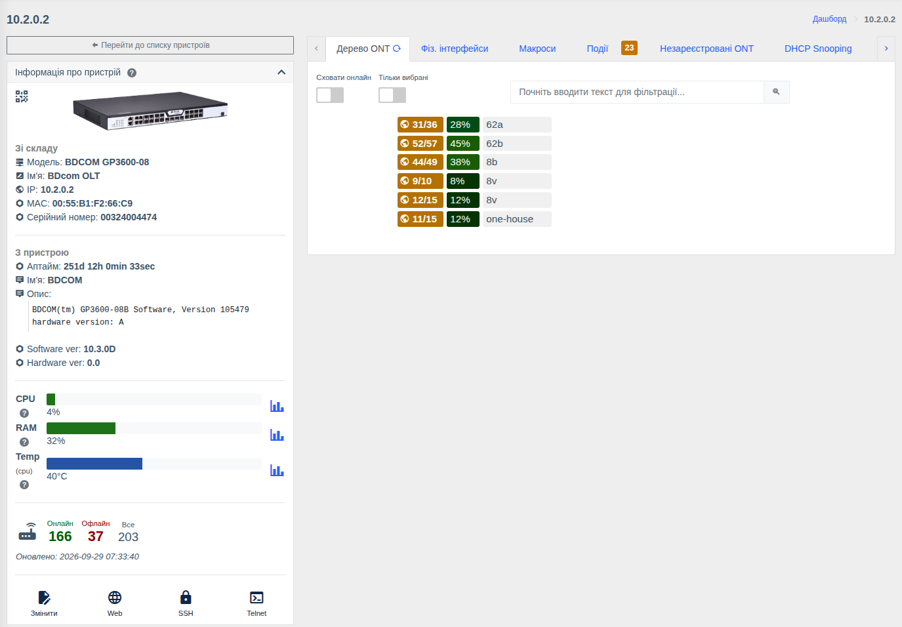
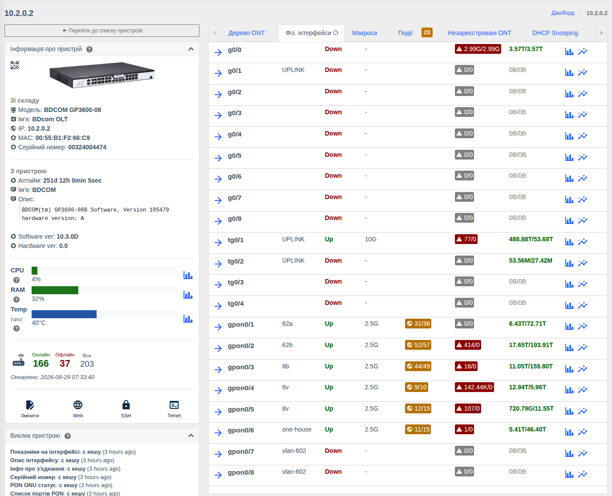
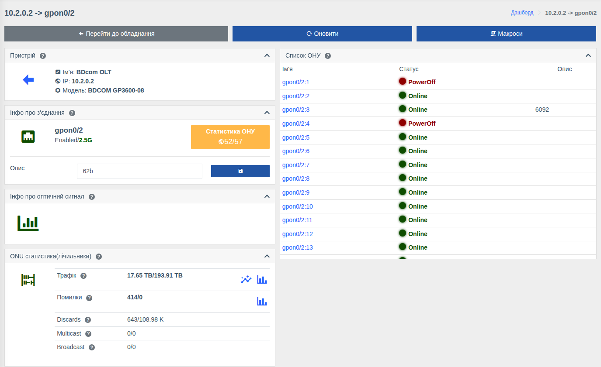

# Робота з OLT

!!! abstract "Огляд"

    Сторінка OLT збирає все про PON-мережу: дерево ONU по портах, фізичні інтерфейси, реєстрацію
    нових ONU, DHCP Snooping, чорний список. Звідси можна перейти на сторінку PON-порту,
    фізичного порту або конкретної [ONU](./onu.md).

    Підтримувані OLT: Huawei MA56xx/MA58xx, ZTE C3xx/C6xx, BDcom P3xxx/GP3600, C-Data,
    V-Solution, GCOM — повний перелік у [Списку обладнання](../supported-hardware.md).
    Набір даних і дій залежить від моделі.

!!! info "Компоненти"
    Сторінку OLT дає компонент [OLT](../components/olts.md) (`olts`), дії з портами — [Керування OLT](../components/olts_control.md) (`olts_control`), реєстрацію — [Реєстрація ONU](../components/onts-registration/getting-started.md) (`onts_registration`), графіки — [Графіки](../components/prometheus_wrapper.md) та [Трафік у реальному часі](../components/live_traffic.md).

Загальні елементи сторінки (ліва панель, вкладки «Події», «Макроси», «Лог статусів» тощо) описані на
сторінці [Список пристроїв і сторінка пристрою](./device-page.md).

## Вкладки OLT

| Вкладка | Призначення |
|---------|-------------|
| **Дерево ONT** | PON-порти та ONU на них |
| **Фіз. інтерфейси** | Усі фізичні порти OLT: аплінки, PON-порти |
| **Незареєстровані ONT** | Нові ONU, які очікують реєстрації |
| **DHCP Snooping** | [Прив'язки MAC/IP/VLAN](./dhcp-snooping.md) по ONU |
| **Блеклист ОНУ** | [Чорний список ONU](./onu-blacklist.md) |
| **Події, Макроси, Лог статусів, Вкладення, Топологія, Бекапи, Пінгер** | [Загальні вкладки](./device-page.md#tabs) |

### Дерево ONT { #ont }

Кожен рядок — PON-порт:

- **ONU онлайн / всього** на порту (`31/36`);
- **заповненість порту** — кількість ONU відносно максимуму для порту (напр. 36 з 128 = 28%); колір змінюється, коли порт наближається до заповнення;
- **опис** порту.

Натисніть на порт, щоб розгорнути список його ONU зі статусом, серійним номером/MAC, описом та
рівнем сигналу. Натискання на ONU відкриває її [сторінку](./onu.md).

Над деревом:

| Елемент | Призначення |
|---------|-------------|
| **Сховати онлайн** | Показати лише ONU, що не в мережі, — швидкий пошук аварій |
| **Тільки вибрані** | Показати лише [обрані](./device-page.md#interface) ONU |
| **Фільтр** | Пошук ONU за назвою інтерфейсу, серійним номером/MAC, описом |

### Фіз. інтерфейси

Таблиця всіх фізичних портів OLT (Ethernet-аплінки та PON-порти):

| Колонка | Опис |
|---------|------|
| Назва та опис | Натискання на стрілку відкриває сторінку порту |
| Статус, швидкість | Стан лінка та поточна швидкість |
| Статистика ОНУ | Для PON — ONU онлайн/всього |
| Помилки | Кількість помилок (червоним — є помилки) |
| Трафік | Обсяг трафіку вхідний/вихідний; значки — **графік за період** та **графік онлайн** (live) |
| Дії | **Конфігурування порта** (опис, адмін. стан) та **Скинути порт** — вимкнути/увімкнути порт з ресетом (якщо модель підтримує і є право «Керування фізичними портами») |

### Незареєстровані ONT

Список ONU, підключених до OLT, але ще не зареєстрованих: порт, серійний номер/MAC та інші дані,
які повідомляє OLT. Кнопка **«Зареєструвати»** відкриває форму реєстрації за вашим шаблоном.
Список оновлюється за розкладом та при відкритті вкладки. Налаштування —
[Реєстрація ONU](../components/onts-registration/getting-started.md).

## Сторінка PON-порту

Відкривається з дерева ONT або таблиці фізичних інтерфейсів.

| Картка | Що показує |
|--------|------------|
| **Інфо про з'єднання** | Назва порту, стан (Enabled/Disabled) і швидкість, **Статистика ОНУ** (онлайн/всього), редагування **опису** порту |
| **Список ОНУ** | Усі ONU порту зі статусом (Online / Offline / LOS / PowerOff) та описом, з посиланням на кожну |
| **Інфо про оптичний сигнал** | Оптика SFP-модуля порту (якщо модель підтримує) та графік історії |
| **ONU статистика (лічильники)** | Трафік, помилки, discards, multicast, broadcast по порту з графіками |
| Загальні картки | Відмітки, зберігання, аптайм, топологія, події, з'єднання, QR — див. [Сторінка порту або ONU](./device-page.md#interface) |

Кнопки вгорі: **Перейти до обладнання**, **Оновити**, **Макроси**.

!!! tip "Локальні описи PON-портів"
    Якщо опис PON-порту потрібно вести лише у WildcoreDMS, не записуючи його на OLT, увімкніть
    параметр [`disable_save_description_on_physical_ifaces`](../management/custom-parameters.md#disable_save_description_on_physical_ifaces).

## Права

| Дія | Право |
|-----|-------|
| Перегляд OLT, дерева ONU, портів | **Інформація з OLT** |
| Конфігурування та скидання фізичних портів | **Керування фізичними портами** |
| Реєстрація ONU | **Реєстрація ONU** |
| Дії з ONU | див. [Сторінка ONU](./onu.md#rights) |

Дії з обладнанням потребують компонента керування OLT. Див. [Ролі та права](../management/roles.md).
