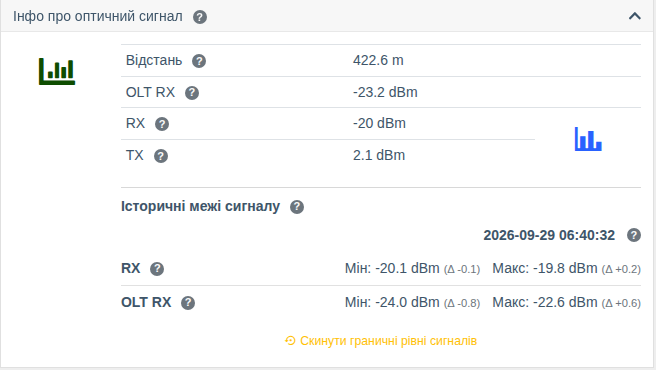

# Історія рівнів сигналу ONU

!!! abstract "Огляд"

    Починаючи з версії **0.31** WildcoreDMS запам'ятовує для кожної ONU **мінімальний і
    максимальний** рівень оптичного сигналу та час останньої зміни. Це дозволяє побачити,
    чи «гуляє» сигнал, навіть якщо в момент перегляду він у нормі — наприклад, через
    погану конекторку або перегин кабелю.

!!! info "Компоненти"
    Збір — [OLT](../components/olts.md) (`olts`) та опитувач; графіки — [Графіки](../components/prometheus_wrapper.md).

## Що зберігається

Для кожної ONU система зберігає:

| Показник | Опис |
|----------|------|
| **RX** | Рівень сигналу, який приймає ONU |
| **TX** | Рівень сигналу, який передає ONU |
| **OLT RX** | Рівень сигналу від ONU, який приймає OLT |

Для кожного показника — **поточне значення**, **мінімум** і **максимум** з моменту останнього
скидання, а також **час останньої зміни**. Значення оновлюються [опитувачем](./poller.md)
(опитування рівнів сигналу) і при відкритті сторінки ONU; запис відбувається лише тоді, коли
значення справді змінилося.

## Де переглянути

### Картка ONU

Сторінка ONU → картка **«Інфо про оптичний сигнал»** → блок **«Історичні межі сигналу»**.

- дата й час останньої зміни сигналу;
- для **RX** та **OLT RX** — **Мін** і **Макс**, а в дужках (Δ) — наскільки межа відрізняється
  від поточного значення;
- кнопка **«Скинути граничні рівні сигналів»** — встановлює мінімум і максимум рівними поточним
  показникам (з підтвердженням). Корисно після ремонту лінії, щоб почати спостереження заново.

### Список ONU

У списку ONU (`Інтерфейси > Список ONT`) доступні сортування за RX з боку OLT та колонка
**«Оптичний RX delta»** — різниця між рівнем RX на ONU та RX на OLT. Велика різниця може
вказувати на проблему в лінії або з оптикою ONU.

## Скидання через API

Скинути межі можна також для всіх ONU пристрою одразу — методами API
`PUT /api/v1/ont-signal/reset/device/{id}` та `PUT /api/v1/ont-signal/reset/interface/{id}`,
див. [API](../api/index.md).

## Права

| Дія | Право |
|-----|-------|
| Перегляд історії | **Перегляд пристроїв** |
| Скидання меж | **Керування інтерфейсами пристроїв** |
