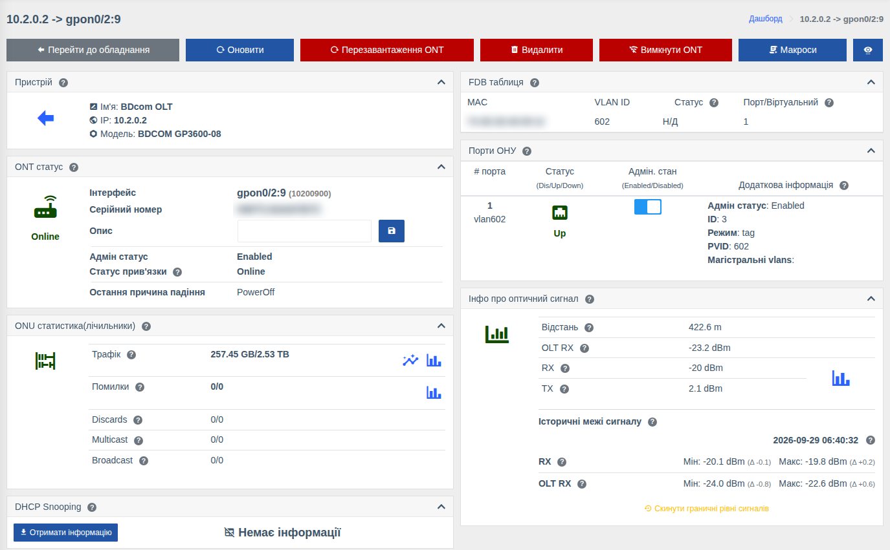

# Сторінка ONU

!!! abstract "Огляд"

    Сторінка ONU — головний інструмент техпідтримки та монтажників: статус і причини відключень,
    рівні сигналу, порти абонента, MAC-адреси за ONU, лічильники та дії з ONU (перезавантаження,
    вимкнення, видалення). Відкривається з [дерева ONT](./olt.md#ont), пошуку, списку ONU або
    посилань у подіях.

!!! info "Компоненти"
    Перегляд — [OLT](../components/olts.md) (`olts`); кнопки дій, опис, UNI-порти — [Керування OLT](../components/olts_control.md) (`olts_control`); графіки — [Графіки](../components/prometheus_wrapper.md), [Трафік у реальному часі](../components/live_traffic.md); FDB історія — [Історія FDB](../components/fdb_history.md); макроси — [Макроси](../components/macros/getting-started.md).

Набір карток і дій залежить від моделі OLT та ONU. Непотрібні картки можна приховати —
див. [Приховати зайві картки](./device-page.md#interface).

## Кнопки дій { #actions }

| Кнопка | Дія | Право |
|--------|-----|-------|
| **Перейти до обладнання** | Повернутися на сторінку OLT | — |
| **Оновити** | Запитати свіжі дані з OLT | — |
| **Перезавантаження ONT** | Перезавантажити ONU (з підтвердженням) | Перезавантаження ONU |
| **Видалити** | Видалити ONU з OLT (скасувати реєстрацію) | Скасування реєстрації ONU |
| **Скинути** | Скинути налаштування ONU | Скидання налаштувань ONU |
| **Вимкнути ONT / Включити ОНУ** | Адміністративно вимкнути або увімкнути ONU | Увімкнення / вимкнення ONU |
| **Макроси** | Запустити [макрос](../components/macros/getting-started.md) для цієї ONU | Запуск макросів |
| Іконка ока | [Керування картками](./device-page.md#interface) | — |

Кнопка показується, лише якщо модель підтримує дію, увімкнено компонент керування OLT і у вас є
відповідне право.

## Картки

### ONT статус

| Поле | Опис |
|------|------|
| **Інтерфейс** | Назва ONU на OLT (напр. `gpon0/2:9`) та внутрішній ID |
| **Серійний номер / MAC-адреса** | Ідентифікатор ONU (GPON — серійний номер, EPON — MAC) |
| **Опис** | Опис ONU на OLT — можна змінити та зберегти прямо тут (право «Редагування опису ONU») |
| **Адмін статус** | Enabled / Disabled — чи увімкнено ONU адміністративно |
| **Статус прив'язки** | Стан на фізичному рівні: **Online**, **Offline**, **LOS** (втрата сигналу — проблема з волокном), **PowerOff** (у абонента вимкнено живлення) |
| **Стан конфігурації** | Чи застосовано конфігурацію ONU на OLT |
| **Остання причина падіння** | Чому ONU востаннє відключалась |
| **Остання реєстрація / скасування**, **В онлайні / В офлайні** | Коли ONU реєструвалась/відключалась і скільки часу в поточному стані (залежить від моделі) |

### Інфо про оптичний сигнал

- **Відстань** від OLT до ONU;
- **RX** — сигнал, який ONU бачить з OLT; **TX** — сигнал, який передає ONU;
- **OLT RX** — сигнал від ONU, який бачить OLT;
- температура та напруга ONU (якщо модель їх віддає);
- значок графіка — історія рівнів сигналу за період;
- **Історичні межі сигналу** — мінімум і максимум з моменту скидання, див.
  [Історія рівнів сигналу ONU](./onu-signal-history.md).

Якщо ONU офлайн, поточні рівні отримати неможливо — дивіться графік історії та історичні межі.

### ONU статистика (лічильники)

Трафік, помилки, discards, multicast та broadcast у напрямках до та від абонента. Значки біля
трафіку — **графік за період** та **графік онлайн** (оновлюється кожні кілька секунд); біля
помилок — графік помилок.

### Порти ОНУ (UNI)

Абонентські порти ONU (LAN/POTS):

- **Статус** — Up / Down / Disabled;
- **Адмін. стан** — перемикач для увімкнення/вимкнення порту (право «Керування UNI-портами на ONU»);
- **Додаткова інформація** — режим VLAN, PVID, магістральні VLAN, швидкість, дуплекс тощо (залежить від моделі).

### FDB таблиця та FDB історія

MAC-адреси за ONU зараз (з VLAN та типом запису) та історія: коли й на якій ONU була кожна
MAC-адреса. Дозволяє знайти, який роутер абонента підключено, і чи не переїхав він на іншу ONU.

### Інші картки

| Картка | Що показує |
|--------|------------|
| **Інформація про постачальника** | Виробник, модель, версія апаратної частини, версії прошивки (active / committed) |
| **Конфігурація ONT** | Поточні параметри ONU на OLT (профілі, VLAN, сервіси — залежить від моделі) |
| **ONT IP-хост** | IP-хости ONU (інтерфейси керування/сервісів): ID, MAC, IP-адреса |
| **Таблиця спадної історії** | Реєстрації та дереєстрації ONU з причинами відключення |
| **DHCP Snooping** | Прив'язки MAC/IP за ONU — кнопка **«Отримати інформацію»**, див. [DHCP Snooping](./dhcp-snooping.md) |
| **Таблиця аптайму** | Історія Up/Down з причинами падіння |
| **Пристрій** | OLT, до якого підключено ONU |
| Загальні картки | Відмітки, зберігання, білінг, топологія, події, з'єднання, положення, QR — див. [Сторінка порту або ONU](./device-page.md#interface) |

## Права { #rights }

| Дія | Право |
|-----|-------|
| Перегляд ONU | **Інформація з OLT** |
| Перезавантаження | **Перезавантаження ONU** |
| Видалення | **Скасування реєстрації ONU** |
| Скидання налаштувань | **Скидання налаштувань ONU** |
| Увімкнення / вимкнення ONU | **Увімкнення / вимкнення ONU** |
| Зміна опису | **Редагування опису ONU** |
| Керування UNI-портами | **Керування UNI-портами на ONU** |
| Очищення лічильників | **Очищення лічильників ONU** |

Див. [Ролі та права](../management/roles.md).
