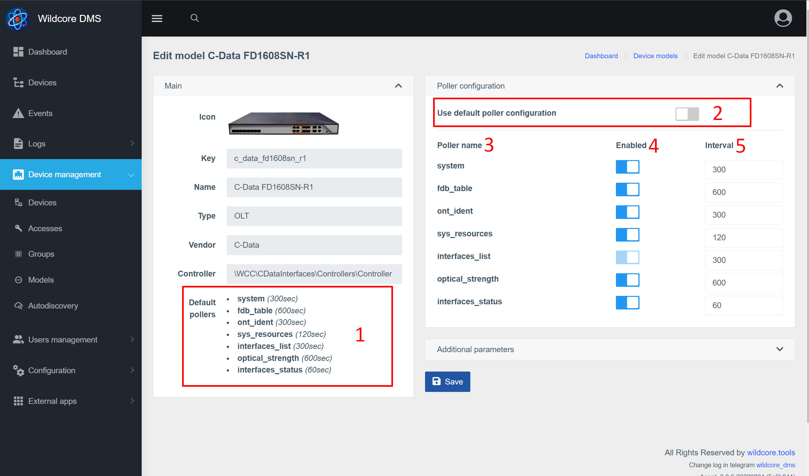

# Опитувальник обладнання
Опитувач апаратного забезпечення працює у фоновому режимі та збирає деяку інформацію з апаратного забезпечення.
За замовчуванням працює 10 екземплярів колекціонера. Це означає, що дані можна збирати до 10 різних пристроїв одночасно.

## Для чого це потрібно?
Дані, отримані від обладнання за допомогою анкети, використовуються для:

* Оновлення кешу - для швидшого завантаження сторінки
* Збір історичних даних - наприклад, побудова сигналу
* Генерація подій і повідомлень на їх основі
* Надсилання метрик до Prometheus

## Список опитувальників
* **arp_table** - таблиця ARP
* **bgp_sessions** - список сеансів BGP
* **counters** - лічильники з інтерфейсів (помилки, трафік)
* **fdb_table** - таблиця FDB
* **interfaces_list** - список інтерфейсів з їх назвами та описами
* **interfaces_status** - статус адміністратора/поточний стан
* **ont_ident** - ідентифікатори ONU (серійні номери/MAC-адреси)
* **optical_strength** - рівні сигналу від ONU (RX,TX,OLT-RX, відстань до ONU, температура)
* **система** - на даний момент збирається лише час безвідмовної роботи пристрою
* **sys_resources** - використання ЦП/пам'яті

## Налаштування Poller
### Зміна інтервалів опитування та опитувальників за моделлю пристрою
Система має можливість змінювати інтервали опитування (в секундах), а також відключати деякі опитувальники.

1. Налаштування опитувальника за замовчуванням
2. Вимкніть цю опцію, щоб змінити опитувачів
3. Ім'я опитувальника
4. Увімкнути/вимкнути опитування
5. Інтервал у секундах

Після внесених змін збережіть зміни в системі.

### Зміна інтервалів опитування та опитувальників за пристроєм
Також можна переписати налаштування опитувальника для конкретного пристрою. Це має сенс, наприклад, якщо у вас кілька олтів з невеликою кількістю ONU, і один, тієї ж моделі, «забитий» під зав'язку.

Налаштування блоку опитування подібне до налаштування за моделлю пристрою.

### Виключити збір даних на певних портах
Зміна впливає на збереження даних опитувальника:

* лічильники
* interfaces_status (для деяких моделей)
* optical_strength

1. ID інтерфейсів у системі
2. Ім'я інтерфейсу
3. Увімкнути / вимкнути збереження метрик за інтерфейсом

_Варто враховувати, що відключення портів впливає лише на збереження метрик, але не на їх збір з обладнання (насправді збір і так відбувається з усіх інтерфейсів)_

### Зміна кількості запущених екземплярів опитувальника
Ви можете вказати необхідну кількість запущених екземплярів через параметр **POLLER_COUNT_PROCS** (у файлі /opt/wildcore-dms/.env або через веб-інтерфейс, у налаштуваннях системи).

Має сенс збільшити кількість екземплярів, якщо ви помітили, що інтервал збору даних з обладнання значно перевищує вказаний інтервал для моделі/пристрою.

Рекомендації щодо встановлення максимальної кількості екземплярів:

* _На основі оперативної пам'яті:_ (загальний обсяг пам'яті - 3,5 Гб) / 0,25 Гб = максимальний обсяг
* _На основі ЦП:_ 2,5 * кількість ядер = максимальна кількість

### Вимкнути спроби збору з недоступного обладнання
Якщо параметр **POLLER_IGNORE_DOWN** має значення _true_ - перед початком роботи з обладнанням буде перевірено його доступність через ICMP.

