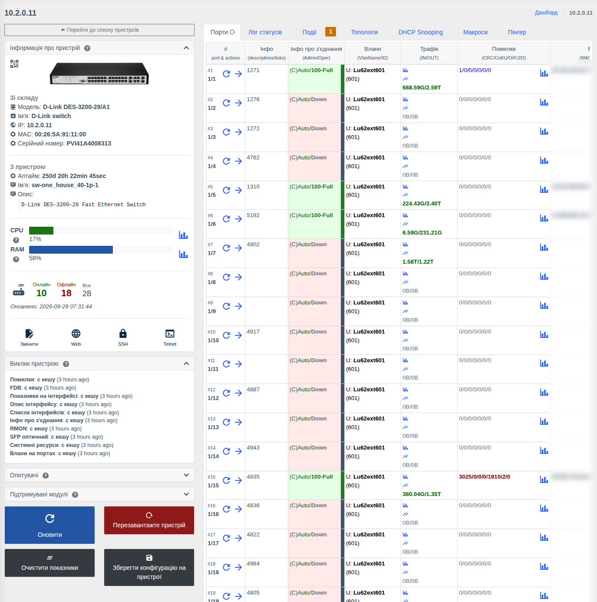
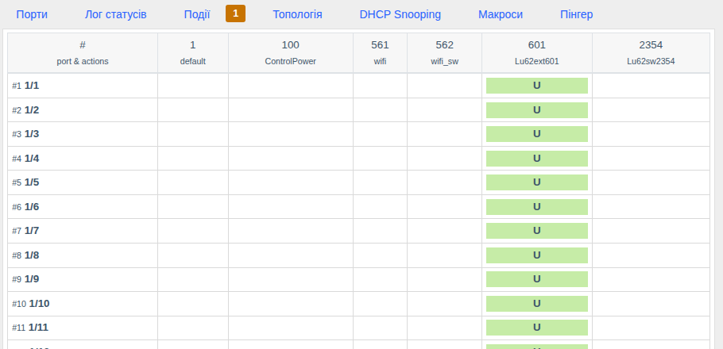
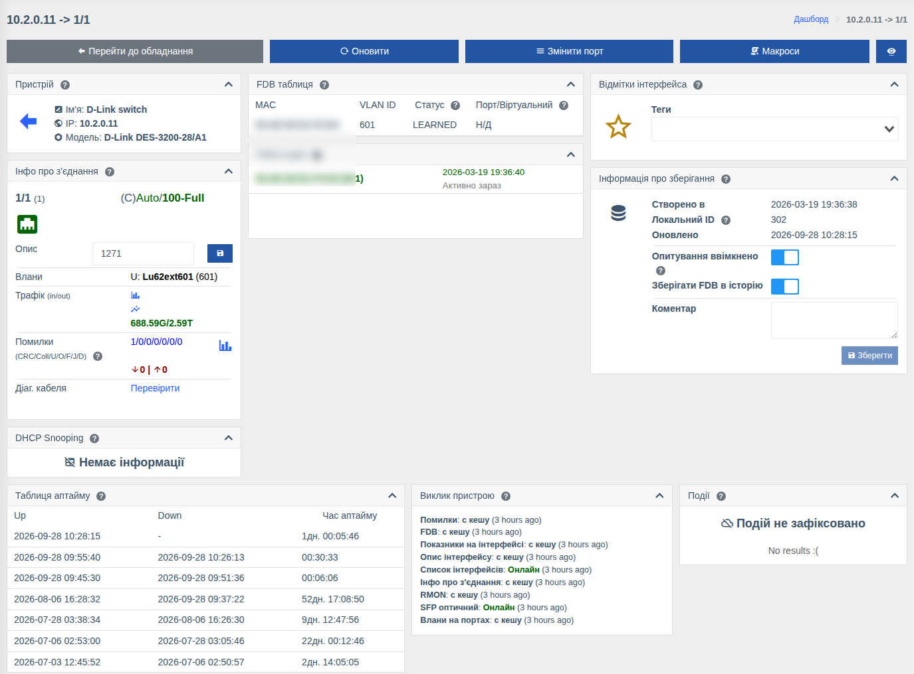

# Комутатори та L3-обладнання

!!! abstract "Огляд"

    Сторінка комутатора показує всі порти з їх станом, VLAN, трафіком, помилками та MAC-адресами,
    дозволяє керувати портами й VLAN, запускати діагностику кабелю та SFP. Для L3-обладнання
    додатково доступні таблиці ARP, FDB та прямих маршрутів.

    Підтримуються D-Link, Edge-core, Huawei, Cisco, Juniper, HP/HPE, Dell, Eltex, Raisecom,
    TP-Link, Mikrotik (SwOS/CRS), Arista та інші — див. [Список обладнання](../supported-hardware.md).
    Набір даних і дій залежить від моделі.

!!! info "Компоненти"
    Перегляд — [Комутатори](../components/switches.md) (`switches`), L3-вкладки — [Маршрутизатори](../components/routers.md) (`routers`); дії з пристроєм і портами, VLAN — [Керування комутаторами](../components/switches_control.md) (`switches_control`); графіки — [Графіки](../components/prometheus_wrapper.md), [Трафік у реальному часі](../components/live_traffic.md); FDB історія — [Історія FDB](../components/fdb_history.md).

Загальні елементи сторінки (ліва панель, вкладки «Події», «Макроси», «Лог статусів», «Топологія»,
«Пінгер» тощо) описані на сторінці [Список пристроїв і сторінка пристрою](./device-page.md).

## Дії з пристроєм { #device-actions }

Кнопки під лівою панеллю:

| Кнопка | Дія | Право |
|--------|-----|-------|
| **Оновити** | Запитати свіжі дані з обладнання | — |
| **Перезавантажте пристрій** | Перезавантажити комутатор (з підтвердженням) | Перезавантаження пристрою |
| **Очистити показники** | Скинути лічильники трафіку та помилок на всіх портах | Очищення лічильників |
| **Зберегти конфігурацію на пристрої** | Записати поточну конфігурацію в пам'ять комутатора | Збереження конфігурації комутатора |

Кнопки показуються, якщо модель підтримує дію, увімкнено компонент керування комутаторами і є право.

## Вкладка «Порти»

Усі порти в одній таблиці:

| Колонка | Що показує |
|---------|------------|
| **#** | Номер і назва порту; кнопки **оновити дані порту** та **перейти на сторінку порту** |
| **Інфо** | Опис порту та з'єднання з іншими пристроями |
| **Інфо про з'єднання** | Адмін. стан / стан лінка та швидкість-дуплекс, напр. `(C)Auto/100-Full` (C — мідь, F — оптика). Колір: зелений — лінк є, червоний — лінку немає |
| **Влани** | VLAN на порту: `U` — untagged, `T` — tagged, з назвою та номером |
| **Трафік** | Вхідний/вихідний обсяг; значки — графік за період та графік онлайн |
| **Помилки** | CRC / Collisions / Undersize / Oversize / Fragments / Jabbers / Drops; зміна з моменту попереднього опитування; графік |
| **FDB** | MAC-адреси на порту |
| **Діагностика** | Результат діагностики кабелю та SFP (якщо модель підтримує) |

Кнопка оновлення біля назви вкладки або **«Оновити»** на лівій панелі запитує свіжі дані з обладнання.

## Вкладка «Влани»

Матриця «порт × VLAN»: для кожного порту видно, у яких VLAN він перебуває і як (`U` — untagged,
`T` — tagged). Кнопка дій біля порту відкриває форму, де можна додати або прибрати VLAN на порту та
змінити режим. Вкладка доступна, якщо модель підтримує керування VLAN і є право
**«Керування VLAN на портах»**.

## Вкладки L3-обладнання { #l3 }

Для маршрутизаторів та L3-комутаторів (крім Mikrotik RouterOS — див. [окрему сторінку](./routeros.md)):

| Вкладка | Що показує |
|---------|------------|
| **Порти** | Як для комутатора |
| **ARPs** | Таблиця ARP: IP ↔ MAC ↔ інтерфейс/VLAN |
| **FDB** | Таблиця MAC-адрес усього пристрою |
| **Прямые маршруты** | Мережі, безпосередньо підключені до інтерфейсів (direct routes) |
| **Влани** | Як для комутатора |

## Сторінка порту

Кнопки вгорі:

| Кнопка | Дія | Право |
|--------|-----|-------|
| **Перейти до обладнання** | Повернутися на сторінку комутатора | — |
| **Оновити** | Запитати свіжі дані порту | — |
| **Змінити порт** | Форма **«Конфігурування порта»**: адмін. стан (увімкнути/вимкнути порт) та адмін. швидкість (auto, 10/100/1000, дуплекс) | Зміна адміністративного стану порту, Зміна швидкості порту |
| **Очистити показники** | Скинути лічильники порту | Очищення лічильників |
| **Макроси** | Запустити макрос для порту | Запуск макросів |

Картки порту:

| Картка | Що показує |
|--------|------------|
| **Інфо про з'єднання** | Назва, стан лінка та швидкість, **опис** (можна змінити й зберегти — право «Зміна опису порту»), VLAN, трафік і помилки з графіками, зміна помилок з попереднього опитування |
| **Діаг. кабеля** | Кнопка **«Перевірити»** запускає діагностику кабелю: стан кожної пари та відстань до обриву/замикання. Автоматичний запуск при відкритті порту вмикається параметром [`enable_auto_cable_diag`](../management/custom-parameters.md#enable_auto_cable_diag) |
| **Інфо про оптичний сигнал** (SFP) | Для оптичних портів: рівні RX/TX, температура, напруга, струм лазера, канали BiDi/WDM, шум RX, паспортні дані модуля |
| **Інтерфейси в LACP** | Для агрегованих каналів — список фізичних портів, що входять в агрегацію, з посиланнями |
| **DHCP Snooping** | Прив'язки MAC/IP на порту — [DHCP Snooping](./dhcp-snooping.md) |
| **FDB таблиця / FDB історія** | MAC-адреси на порту зараз та історія |
| **Таблиця аптайму** | Історія Up/Down порту |
| Загальні картки | Відмітки, зберігання, білінг, топологія, події, з'єднання, положення, QR — див. [Сторінка порту або ONU](./device-page.md#interface) |

!!! note
    Діагностика кабелю на частині обладнання ненадовго перериває лінк на порту.

## Права

| Дія | Право |
|-----|-------|
| Перегляд комутатора та портів | **Інформація з комутаторів** |
| Перезавантаження пристрою | **Перезавантаження пристрою** |
| Збереження конфігурації | **Збереження конфігурації комутатора** |
| Очищення лічильників | **Очищення лічильників** |
| Зміна опису порту | **Зміна опису порту** |
| Увімкнення/вимкнення порту | **Зміна адміністративного стану порту** |
| Зміна швидкості порту | **Зміна швидкості порту** |
| Керування VLAN | **Керування VLAN на портах** |

Див. [Ролі та права](../management/roles.md).
