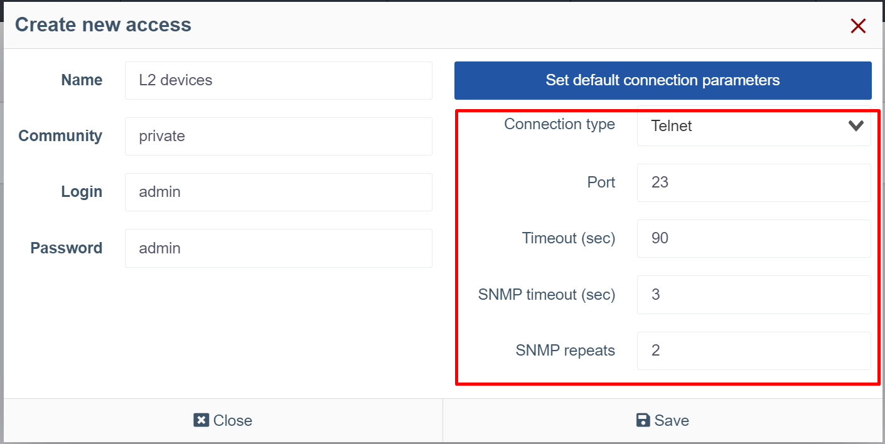
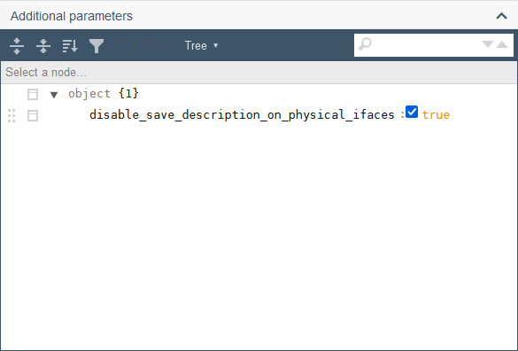
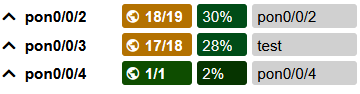

# Робота з обладнанням

## Взаємодія з обладнанням
Wildcore система може спілкуватися з апаратним забезпеченням через **snmp версії 2c**,
через **консоль**(ssh/telnet), а також через **API** (для RouterOS).

У доступі до обладнання можна вказати порти, якщо ваша мережа використовує нестандартні порти 



## Налаштування параметрів роботи з обладнанням

## Опитування обладнання
### Отримання стандартизованого виводу через модулі комутатора
Будь-яка взаємодія з системою здійснюється шляхом виклику певних модулів switcher-core.
Кожен виробник і модель мають свій набір модулів.
Список підтримуваних модулів за обладнанням можна отримати за допомогою команди
```shell linenums="1"
wca switcher-core:modules DEVICE_IP     
```     

### Відображення інформації у веб-інтерфейсі
Система спрямована на відображення «живої» інформації з обладнання.

Але, враховуючи, що потрібна ще й прийнятна швидкість завантаження сторінок, ми пішли на компроміс у вигляді кешування відповідей.
Щоб переглянути, яка інформація була отримана з системного кешу, а яка з обладнання - розгорніть блок «Мета інформація» (Status-info) на сторінці обладнання з інтерфейсами / в ONU.

На скріншоті вище показано назву модуля, а також джерело, з якого були отримані дані:

* **з кешу (ДАТА)** - дані отримані з кешу, а ДАТА вказує дату, коли ці дані були додані до кешу
* **online** - дані отримані від обладнання.

Якщо вам потрібні "живі" дані - натисніть кнопку "Оновити інформацію" (оновлення сторінки може зайняти деякий час. Зазвичай 15-30 секунд)

Також варто враховувати, що деякі дані можуть відображатися за допомогою Prometheus (наприклад, рівні сигналу), і кнопка «Перезавантажити інформацію» не оновить цю інформацію.
_ Щоб дізнатися більше про те, які дані та яке обладнання взято з Prometheus, дивіться опис компонентів за типом обладнання, яке вам потрібно

## Глобальні налаштування


## Додаткові налаштування
### Параметри моделі/приладу
#### Локальні описи PON

Додайте наступний параметр у панелі **Додаткові параметри** моделі або пристрою, щоб вимкнути збереження та синхронізації опису PON портів, та мати змогу налаштувати їх локально.

`"disable_save_description_on_physical_ifaces": true`





!!! info "Інформація"
    Зверніть увагу, що для того, щоб ввести параметр у поле вручну, необхідно змінити тип відображення **Tree** на **Code** у центрі панелі інструментів на панелі параметрів.


