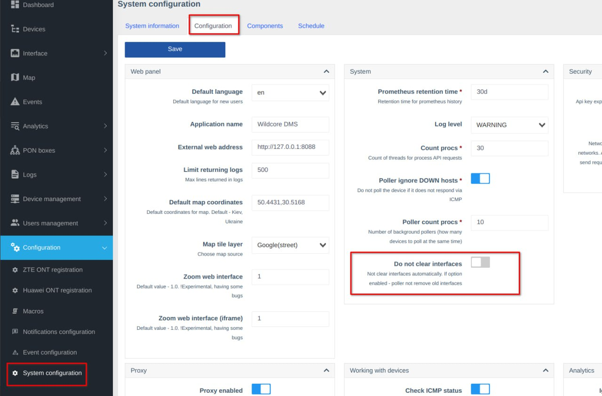

!!! abstract "Огляд"
    Ця сторінка надає різноманітні помилки, з якими ви можете зустрітися під час роботи з WildcoreDMS, та способи їх вирішення.

    Скористайтеся меню справа, щоб перейти до розділу, який вас цікавить.

## Крок 0: Очистіть кеш та оновіться 
Якщо протяом роботи ви зустрічаєте проблеми з агентом, спершу переконайтеся, що ви використовуєте правильно встановлену останню версію системи.

Виконайте наступні команди, щоб виключити можливі проблеми з цим:

```shell linenums="1"
cd /opt/wildcore-dms 
sudo docker compose down --remove-orphans
sudo docker compose up -d --build 
sleep 10 
wca cache:flush
wca cache:redis:flush-all
```
Якщо проблема або помилка не зникла, спробуйте наступний розділ з відомими помилками та способами їх вирішення.

## Крок 1: Відомі помилки та їх вирішення

### Агент вже зареєстрований за іншою ІР адресою

Ця помилка може виникнути, якщо публічна ІР адреса вашого сервера змінилася.

Вирішення:

1. Увійдіть до Особистого Кабінету.
2. Перейдіть на сторінку Агенти, та знайдіть той, що викликає помилку.
3. Натисніть кнопку Змінити у вернхьому правому куті.
4. Натисніть `Reset bound IP address` біля поточно зареєстрованої ІР адреси.
5. Виконайте `wca-tool register` на потрібному сервері.

### Пошук абонента за MAC адресою повертає інтерфейси на транспортних портах

Вирішення: вимкніть сбір FDB на даному інтерфейсі.

Варіант 1: Вкажіть лінк на транспортному інтерфейсі, при наявності якого МАС адреса не збирається.

Варіант 2: Вимкніть збір МАС адреси (прапорець у картці інтерфейсу).

### Список пристроїв OLT і Статистика системи Дешборду відображають різні кількості Інтерфейсів

Інтерфейси без статусу не враховуються у кількості в Списку пристроїв.

Вирішення: Вимкніть прапорець **Не очищати інтерфейси** у меню Конфігурація - Конфігурація системи - панель Система.



## Крок 2: Зв'яжіться з Підтримкою

Перед тим як подати заявку:

1. **Впевніться, що використовуєте найновішу версію агента та wca-tool**
2. Запустіть команди, описані в [Крок 0](#0).
3. Впевніться, що у сервера є стабільний доступ до обладнання (напр. ping та snmpwalk).

Якшо попередні кроки не вирішили проблему, при поданні заявки, спробуйте описати якнайможна точніше дії, які викликають проблему. Вкажіть:

* Характеристики системи, на якій запущене програмне забезпечення.
* Роль користувача, для якого виникає помилка.
* Які права видані цій групі користувачів.
* Яке обладнання (якщо це проблема з обладнанням) має проблеми.

    Також, бажано надати вивід команди `wca switcher-core:call IP_ОБЛАДНАННЯ system`.

* Надайте скріншоти.
* Опишіть що саме є проблемою, навіть якщо це очевидно для вас.
* Який рівень доступу до обладнання було надано (SNMP Community String - RO або RW, логін/пароль від користувача або адміністратора).

[Контаки Підтримки користувачів](../../contact/contacts.md)
