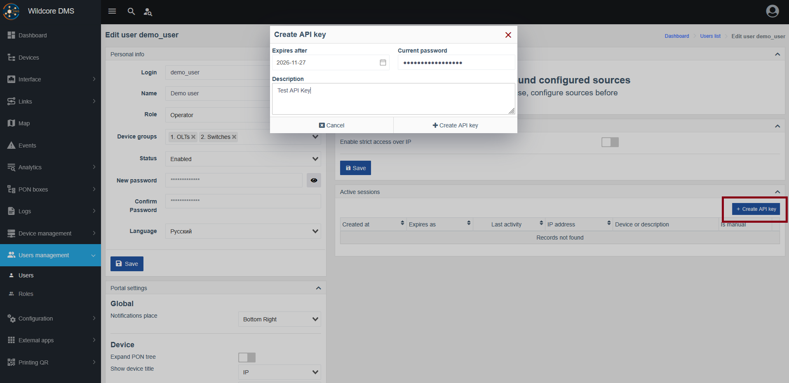

# Генерація API ключа

!!! abstract "Огляд"

    Ця сторінка надає огляд функціоналу створення API ключа через веб інтерфейс.

    У випадку, ящко вам потрібен API ключ (наприклад для інтеграції із сторонніми сервісами, такими як біллінг) їх можна легко створити на відізвати через веб інтерфейс.

## Створення API ключа
Щоб створити ключ, існують дві можливості:

1. Для адміністраторів:
    - Перейдіть до `Користувачі > Користувачі` та натисніть `Редагувати` біля потрібного користувача
      

2. Для користувачів:

    - Перейдіть до сторінки `Параметрів аккаунту`

Після чого:

- Знайдіть кнопку `Створити API-ключ` у панелі `Активні сесії` та натисніть її.
- Заповніть форму, вказавши `Термін придатності`, `Опис`, а також ваш пароль для підтвердження.
- Натисніть `Створити API ключ`.

??? quote "Візуальна допомога"
    