!!! abstract "Огляд"
    Ця сторінка надає опис **Дешборду**, його **Віджетів** та їх функціоналу.

    Скористайтеся меню **Зміст** справа, щоб перейти до розділу, що вас цікавить.

## Дешборд

Це сторінка, що вітає вас після входу до вашого облікового запису, і може бути знайдена у меню зліва.

Вона дотримується принципу Responsive Design, і її вміст може змінюватися, в залежності від розміру екрану вашого пристрою.

??? info "Вигляд на ПК"

    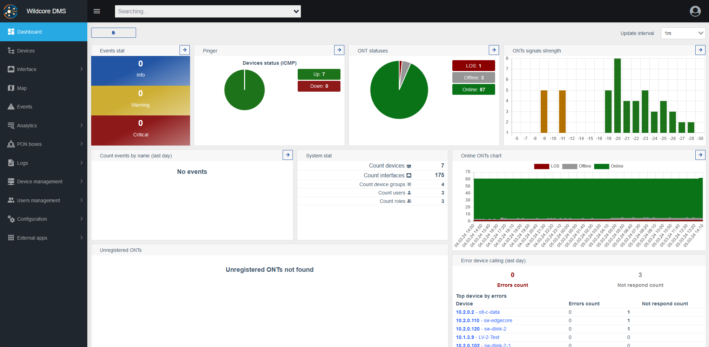

??? info "Вигляд на мобільному пристрої"

    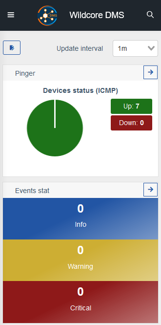

**Дешборд** містить у собі **Віджети**, у яких представлена різноманітна інформація про ваші пристрої.

Також, він має кнопку зліва і випадаюче меню справа.

| Вигляд | Опис |
| ---------- | ----------- |
| 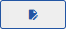 | Перемикає **Режим редагування** Дешборду. |
| 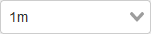 | Дозволяє обрати інтервал оновлення даних для **Віджетів**. |

## Режим редагування Дешборду

Ця кнопка дозволяє вмикати **Режим редагування** та виходити з нього.

За замовчуванням, зміни компонування **Дешборду** зберігаються лише для поточного користувача.

**Дешборд** відображає **Віджети** на основі **Дозволів**. Таким чином, користувачі без відповідних дозволів не зможуть використовувати або побачити відповідні віджети, а на їх місці буде порожнє місце. Режим редагування дозволяє користувачам вручну змінити компонування свого Дешборду, щоб збільшити ефективність роботи з ним.

Коли режим редагування увімкнено, з'являються додаткові елементи інтерфейсу.

| Вигляд | Опис |
| ---------- | ----------- |
| 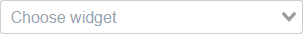 | Додає обраний віджет до Дешборду. |
| 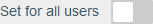 | Дозволяє перезаписати компонування Дешборду усіх користувачів на поточний. |
|  | Дозволяє переміщувати віджети. Цей тип курсору з'являється, коли ви наводите на віджет. |
| 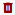 | Видаляє відповідний віджет. |
|  | Дозволяє змінювати розмір віджетів, і знаходиться у нижньому правому куті кожного окремого віджета. |

## Огляд Віджетів

!!! note "Примітка"
    Цей розділ надає опис кожного типу віджета, що може мати Дешборд.

    Скористайтеся меню **Зміст** справа, щоб перейти до розділу, що вас цікавить.

### Пінгер

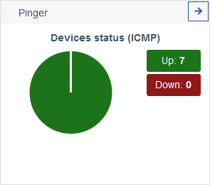

Надає короткий опис станів усіх ICMP пристроїв.

| Стан | Опис |
| -- | ---- |
| Up | Пристрій онлайн. |
| Down | Пристрій оффлайн. |

### Пінгер

Надає короткий опис станів усіх пристроїв.

Цей віджет перевіряє доступність хостів через `ICMP` та виводить їх статуси за кольорами.

!!! note "Примітка"
    У разі, якщо не було відповіді через `ICMP`, він також перевіряє через `TCP` (порти `22`, `23`, `80`). Це може стати причиною повідомлень про підключення з невідомих логінів ("анонім" або "невідомо").

    У разі, якщо хост недоступний, його опит не буде проводитися ні фоном, ні через веб-інтерфейс.

### Статуси ОНУ

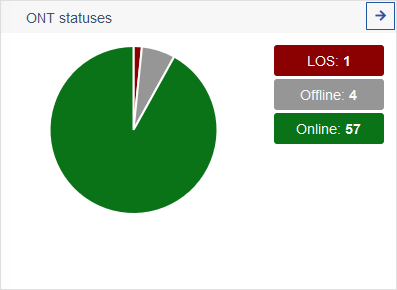

Ця секторна діаграма представляє стани усіх ваших ОНУ.

| Стан | Опис |
| -- | ---- |
| LOS | Loss of Signal (втрата сигналу). Вказує на те, що у пристроя може бути проблема з оптичним кабелем. |
| Online | ОНУ онлайн і працює у штатному режимі. |
| Offline | ОНУ оффлайн, або має проблеми. |

### Зведення подій (за ступенем тяжкості)

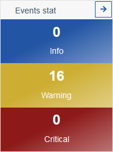

Надає швидкий огляд подій на пристроях.

| Стан | Опис |
| -- | ---- |
| Info | Відбулася подія, що може вимагати вашої уваги. |
| Warning | Відбулася подія, що вимагає вашої уваги. |
| Critical | Відбулася критична подія, що вимагає вашої уваги, можливо несправність. |

### Статистика подій (за ім'ям)

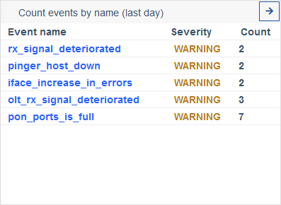

Надає більш детальний огляд подій.

### Таблиця подій

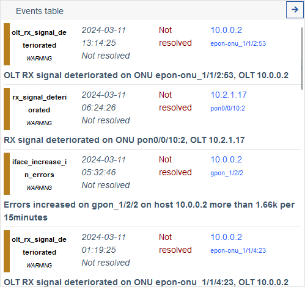

Надає детальний огляд подій у вигляді таблиці.

### Остання активність користувачів

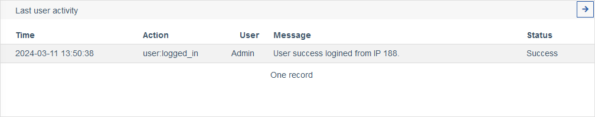

Надає журнал активності користувачів, такої як вхід до системи, вихід, абощо.

### Незареєстровані ОНУ

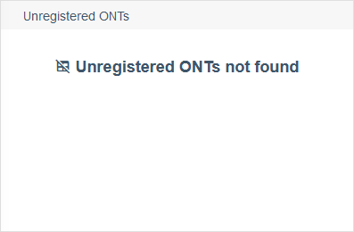

Надає список усіх незареєстрованих ОНУ, якщо такі є.

### Статистика системи

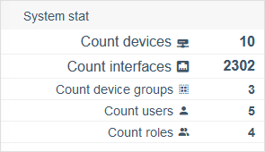

Надає огляд статистик системи.

| Назва | Опис |
| -- | ---- |
| Кількість пристроїв | Кількість пристроїв, що має ваша система. |
| Кількість інтерфейсів| Кількість інтерфейсів, що має ваша система. |
| Кількість груп | Кількість груп пристроїв, що має ваша система. |
| Кількість користувачів | Кількість зареєстрованих користувачів, що має ваша система. |
| Кількість ролей | Кількість різних ролей, що має ваша система. |

### Помилки роботи з обладнанням (ост. доба)

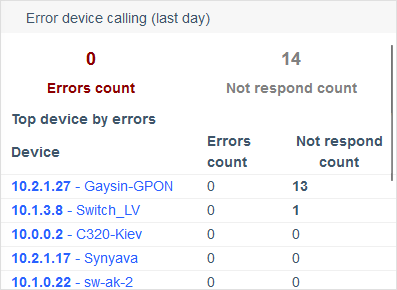

Надає огляд пристроїв у вигляді таблиці, що мали помилки або не могли бути опитані за останню добу.

### Онлайн пристрої

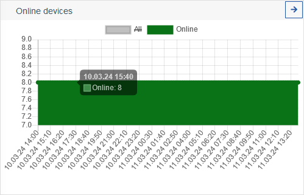

Надає графік змін кількості онлайн пристроїв з часом.

### Онлайн графік ONT

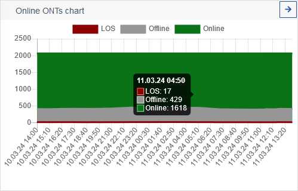

Надає графік зміни статусів ОНУ з часом.

### Рівні сигналів ОНУ

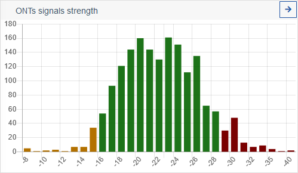

Надає графік сили сигналів ОНУ.