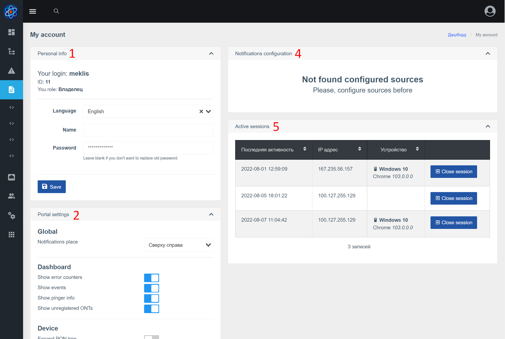

Веб-інтерфейс – це програма SPA([wiki](https://ru.wikipedia.org/wiki/%D0%9E%D0%B4%D0%BD%D0%BE%D1%81%D1%82%D1%80%D0%B0%D0%BD%D0%B8%D1%87%D0%BD%D0%BE%D0%B5_%D0%BF%D1%80%D0%B8%D0%BB%D0%BE%D0%B6%D0%B5%D0%BD%D0%B8%D0%B5))),
який працює API Wildcore DMS.

## Опис основних елементів
### Сторінка входу

### Базові елементи, приладова панель

1. Блок меню
2. Кнопка меню
3. Глобальний пошук (дозволяє шукати пристрої, інтерфейси, ONU)
4. Налаштування облікового запису (зміна імені, пароля, мови, контактів тощо)
5. Блок заходів
6. Блок пінгерів
7. Блок помилок монтажу / Робота з помилками

### Інформаційна панель пристрою

1. Група пристроїв (назва та опис)
2. Кількість пристроїв (онлайн/загальна)
3. Кількість інтерфейсів (онлайн/загальна)
4. Відображення кнопок управління (розгорнути всі групи / приховати всі групи / перезавантажити список з сервера)
5. Фільтр пристрою (зберігається в браузері)
6. Назва пристрою
7. Кількість інтерфейсів (онлайн/офлайн/всього)
8. Піктограма, яка вказує на те, що пристрій офлайн (якщо іконка сіра, даних про статус ще немає)

### Налаштування аккаунта

1. Основна інформація про обліковий запис
2. Параметри порталу (дозволяє налаштувати деякі параметри через веб-інтерфейс)
3. Кнопка збереження
4. Налаштування сповіщень (відображається, якщо присутній компонент сповіщень). Дозволяє додавати контакти та налаштовувати параметри сповіщень.
5. Блокування сесій. Дозволяє бачити ваші активні сеанси, звідки ви входили, з якого пристрою та коли востаннє ним користувалися.

