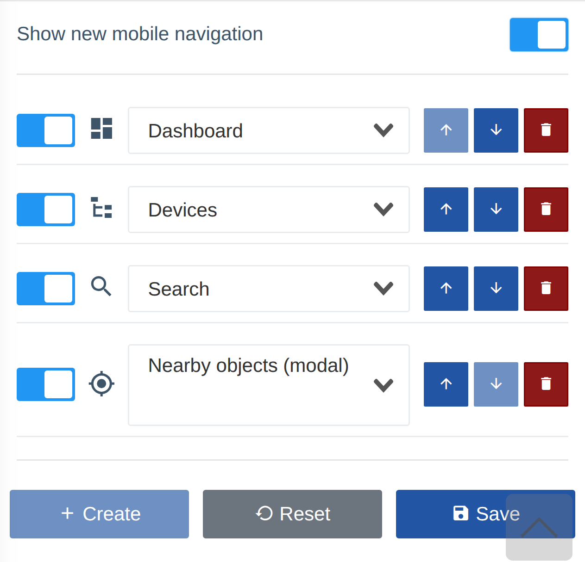

!!! abstract "Огляд"
    Ця сторінка описує **оновлену нижню навігацію** для мобільних пристроїв: як її увімкнути, налаштувати набір кнопок та як нею користуватися.

    Скористайтеся меню **Зміст** справа, щоб перейти до розділу, що вас цікавить.

## Що це таке

**Нижня навігація** — це панель швидкого доступу, закріплена внизу екрана на мобільних пристроях. Вона містить до **4 кнопок**, які ви обираєте самостійно: сторінки з головного меню (наприклад, **Дешборд** чи **Список пристроїв**) та дії пошуку (**Пошук**, **Пошук за** і **Об'єкти поруч**).

Налаштування персональне — кожен користувач формує власний набір кнопок. Воно зберігається у параметрах облікового запису і застосовується на всіх ваших пристроях.

??? info "Вигляд на мобільному пристрої"

    

## Як увімкнути та налаштувати

Налаштування знаходяться у **Параметрах акаунту** → картка **Нижня навігація**.

1. Увімкніть перемикач **«Показувати оновлену мобільну навігацію»** — без нього панель не з'являється.
2. Сформуйте список кнопок (до **4**):
    - **Перемикач зліва** в рядку — тимчасово вмикає/вимикає кнопку, не видаляючи її зі списку.
    - **Випадаючий список** — обирає, що саме робить кнопка (сторінка меню або дія пошуку).
    - **Стрілки ↑ / ↓** — змінюють порядок кнопок (саме в цьому порядку вони з'являться у панелі).
    - **Кошик** — видаляє кнопку зі списку.
3. Кнопка **«Створити»** додає новий рядок (поки кнопок менше за 4 і є ще доступні пункти).
4. Кнопка **«Скинути»** повертає набір за замовчуванням: **Дешборд**, **Список пристроїв**, **Пошук**, **Об'єкти поруч**.
5. Натисніть **«Зберегти»**, щоб застосувати зміни.

!!! note "Що можна додати"
    У списку доступні **лише ті сторінки, до яких у вас є доступ** (за дозволами та підключеними компонентами). Дія **«Пошук за»** з'являється лише якщо відповідний пошук увімкнено. Дію **«Об'єкти поруч»** відкриває швидке вікно пошуку поблизу — докладніше в розділі [Об'єкти поруч](./nearby-objects.md).

## Як користуватися

Після збереження панель з'являється внизу екрана на мобільному пристрої. Торкніться кнопки, щоб одразу перейти на сторінку або відкрити відповідну дію пошуку. Якщо потрібен інший набір кнопок — поверніться до **Параметрів акаунту** і відредагуйте список у будь-який момент.
