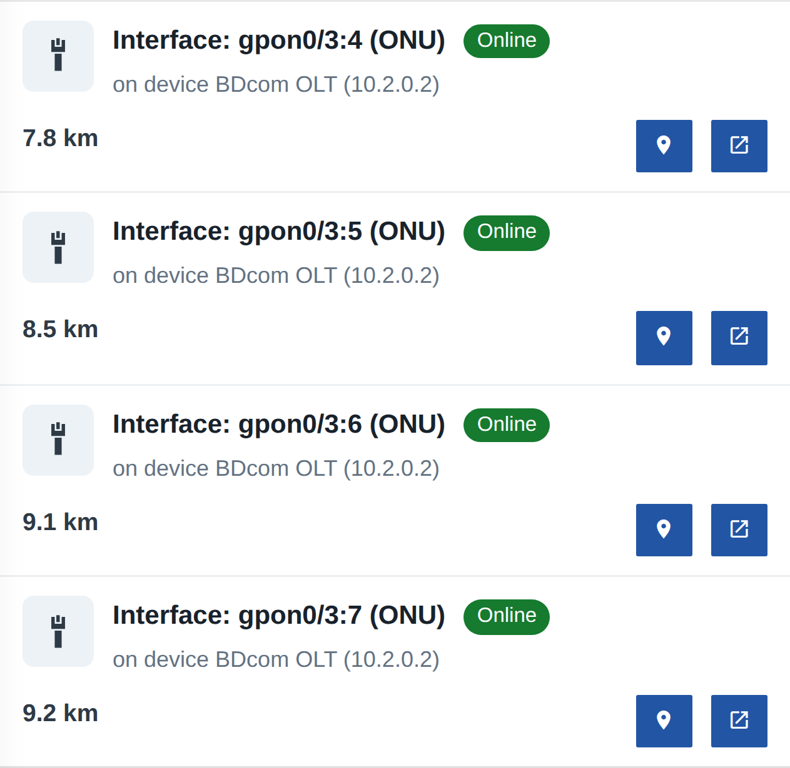
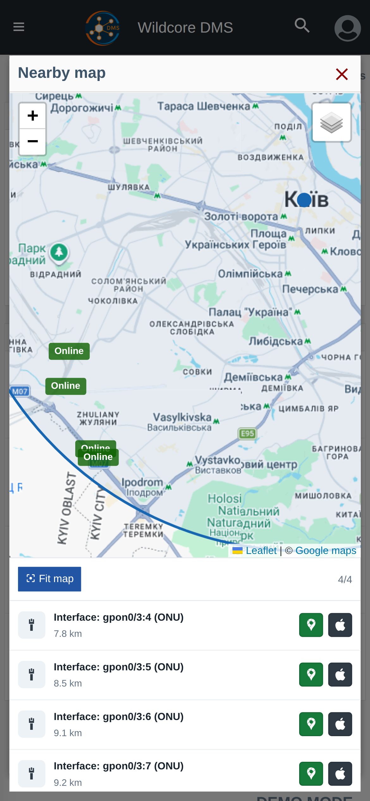

!!! abstract "Огляд"
    Ця сторінка описує функцію **Об'єкти поруч** — пошук пристроїв та ONU поблизу заданої точки, з переглядом результатів списком і на мапі та побудовою маршруту.

    Скористайтеся меню **Зміст** справа, щоб перейти до розділу, що вас цікавить.

## Що це таке

**Об'єкти поруч** допомагає швидко знайти інфраструктуру навколо певної точки — наприклад, коли ви виїхали на місце й хочете побачити, які пристрої, ONU чи бокси розташовані поряд. Результати показуються списком із відстанню до кожного об'єкта та можуть бути відкриті на мапі з побудовою маршруту.

Функція доступна двома шляхами:

- **Окрема сторінка** — пункт меню **«Об'єкти поруч»**;
- **Швидке вікно** — кнопка **«Об'єкти поруч»** у [нижній навігації](./mobile-navigation.md) на мобільному пристрої.

??? info "Вигляд сторінки"

    

## Як задати точку пошуку

Центр пошуку можна визначити одним зі способів:

| Дія | Опис |
| --- | --- |
|  | **Використати моє місцезнаходження** — визначає поточні координати через геолокацію пристрою. Повторне натискання оновлює місцезнаходження. |
|  | **Вибрати на мапі** — відкриває мапу, де можна вручну вказати точку пошуку. |

Останнє використане місцезнаходження запам'ятовується, тож наступного разу пошук одразу готовий до роботи.

## Фільтри

| Фільтр | Опис |
| --- | --- |
| **Відстань** | Радіус пошуку навколо точки: від 100 м до 10 км. |
| **Тип об'єкта** | Що шукати: усі об'єкти, пристрої, інтерфейси або бокси. Для інтерфейсів можна окремо обрати **ONU**. |
| **Ліміт** | Максимальна кількість результатів (1–500, за замовчуванням 100). |

Обрані фільтри запам'ятовуються між сеансами.

## Результати

Знайдені об'єкти показуються списком, відсортованим за відстанню. Для кожного відображається:

- іконка та назва об'єкта, **статус** (онлайн/офлайн) для пристроїв;
- додаткові відомості (за наявності) та **відстань** до точки пошуку;
- кнопка **«Показати на мапі»** і кнопка **«Відкрити об'єкт»** (перехід на дешборд об'єкта).

## Перегляд на мапі та маршрут

Кнопка **«Показати на мапі»** відкриває всі знайдені об'єкти на мапі. Для кожного об'єкта з координатами доступна побудова маршруту:

- **Маршрут у Google Maps**;
- **Маршрут в Apple Maps**.

!!! note "Координати об'єктів"
    У результати потрапляють лише об'єкти, для яких задано координати. Якщо потрібний пристрій чи ONU не з'являється — перевірте, чи вказані його координати на відповідному дешборді.
