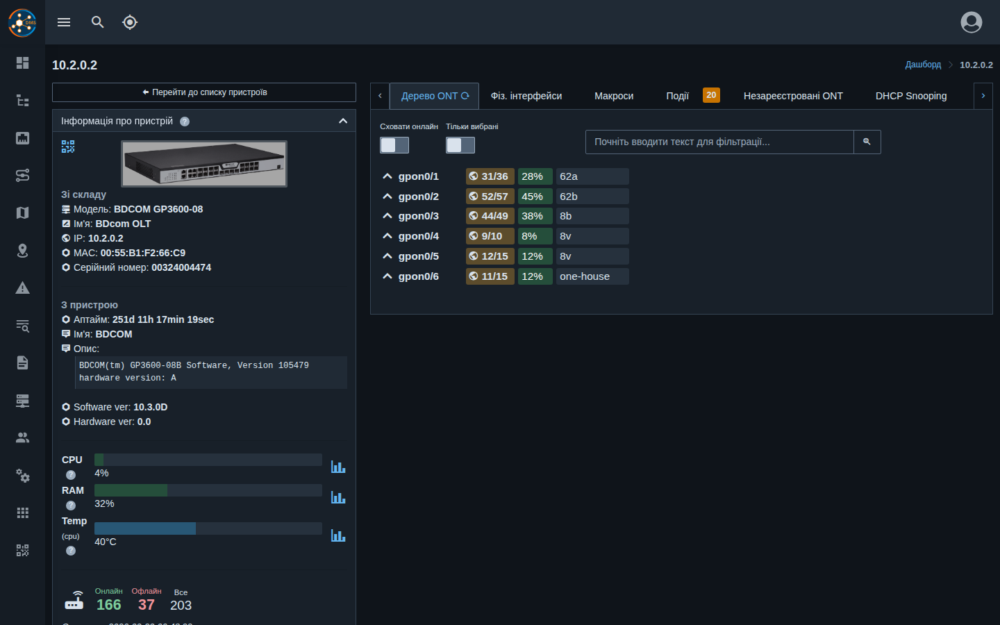
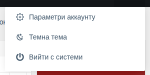
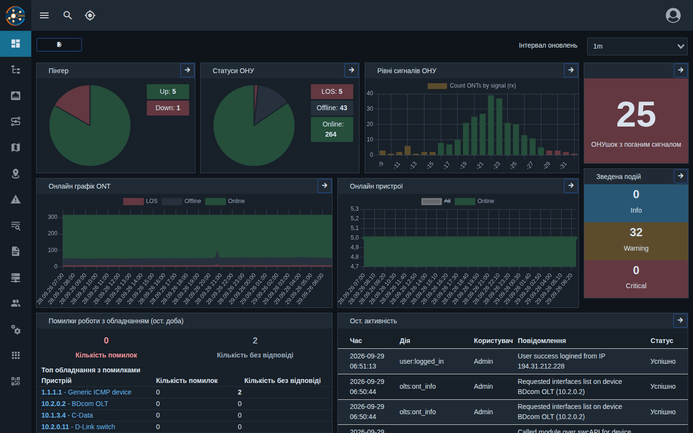

# Темна тема та підказки

!!! abstract "Огляд"

    Починаючи з версії **0.31** веб-панель має **темну тему** та **підказки до полів** на
    картках пристроїв, OLT та ONU.

## Темна тема

### Як увімкнути

1. Натисніть іконку профілю у правому верхньому куті.
2. Оберіть **«Темна тема»** (у темній темі пункт називається **«Світла тема»** — для повернення).

Перемикач доступний і в мобільній версії.

### Як це працює

- Доступні дві теми — **світла** (за замовчуванням) та **темна**.
- Вибір **запам'ятовується в браузері** на цьому пристрої: на іншому комп'ютері чи телефоні
  тему потрібно обрати окремо. В налаштування облікового запису вона не зберігається.
- Тема одразу застосовується в усіх відкритих вкладках і встановлюється ще до завантаження
  сторінки — без «спалаху» світлої теми.
- У темній темі адаптовано таблиці, календарі, топологію, карту, консоль, журнали, блоки портів
  і діагностики кабелю, статуси ONU, графіки та віджети дашборду.

## Підказки до полів

Біля назв карток і полів на сторінках пристроїв, OLT та ONU є значок **«?»**. Наведіть на нього
курсор (на телефоні — торкніться), щоб побачити пояснення: що означає показник, в яких одиницях
та звідки він береться.

Щоб прибрати значки, увімкніть **«Вимкнути підказки»** у
[Параметрах аккаунту](./user-settings-overview.md) → «Налаштування порталу» → «Глобальні».
Налаштування зберігається в обліковому записі.
