!!! abstract "Огляд"
    Ця сторінка надає опис сторінки **Параметрів аккаунту**.

    Скористайтеся меню **Зміст** справа, щоб перейти до розділу, що вас цікавить.

!!! note "Примітка"
    Деякі налаштування можуть потребувати перезавантаження сторінки, щоб вступити в силу.

## Інформація про користувача
Цей розділ надає огляд поточного ім'я користувача і його ролі, та дозволяє змінити їх, а також пароль та мову відображення системи.

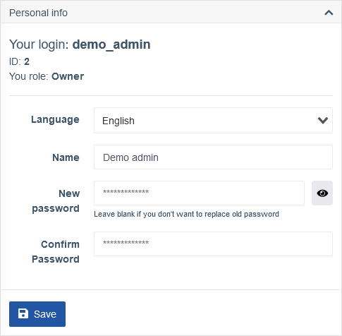

| Поле | Опис |
| ---- | ---- |
| **Ваш логін** | Логін поточного користувача. |
| **ID** | ID поточного користувача. |
| **Ваша роль** | Поточна роль, що назначена поточному користувачеві. |
| **Мова** | Дозволяє змінити мову відображення системи для поточного користувача. |
| **Ім'я** | Дозволяє змінити відображуване ім'я поточного користувача. |
| **Новий пароль** | Дозволяє змінити пароль поточного користувача. |
| **Підтвердіть пароль** | Обов'язкове поле, якщо ви хочете змінити пароль. |
| **2FA** | Дозволяє захистити аккаунт за допомогою двухфаторної автентифікації. |

### Як налаштувати та користуватись 2FA
1. Натисніть **Включити** поряд з **2FA**.

    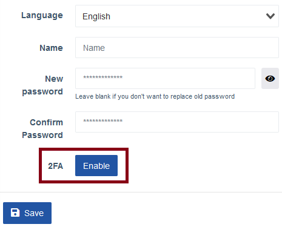

2. З'явиться віконце з інструкціями.

    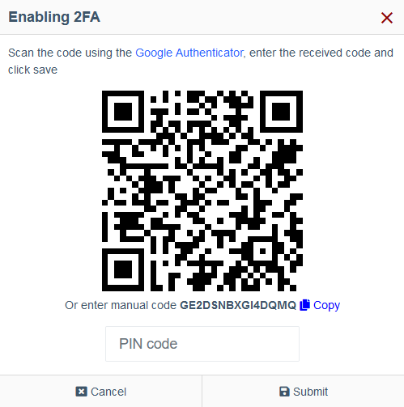

    Завантажте та встановіть додаток [Google Authenthicator](https://play.google.com/store/apps/details?id=com.google.android.apps.authenticator2) з Play Store та додайте новий генератор кодів. Ви можете відсканувати показаний QR код, або ввести код знизу нього вручну.

3. Після того як ви додали новий генератор, кожні 30 секунд на вашому пристрої буде згенеровани новий код. Введіть його в поле під QR кодом та натисніть **Підтвердити**.

    Якщо код був правильним, з'явиться повідомлення про успіх.

    

    Якщо ви зтикнулися з повідомленням Пін-код невірний, впевніться, що ввели код генератора та 6-значний код правильно та вчасно. Як тільки термін давності попереднього коду вичерпано і згенеровано новий, він більше не дійсний.

4. Тепер при успішному введенні даних від аккаунту вам потрібно також буде ввести 2FA код для входу до нього.

    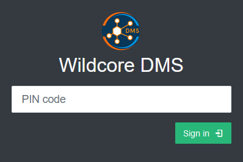

    Коли 2FA включено, ви більше не зможете зайти без автоматично згенерованого коду.
    
    **Зробіть копію коду генератора про всяк випадок та зберігайте у надійному місці.**
    
    Наприклад, **GE2DSNBXGI4DQMQ** - це код у цій демонстрації, як видно на картинці з кроку 2.

## Налаштування порталу
Цей розділ надає налаштування, що мають відношення до різних функцій відображення елементів інтерфейсу.

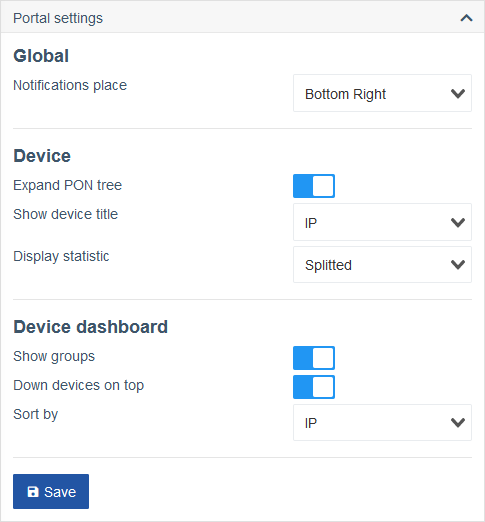

### Глобальні
| Поле | Опис |
| ---- | ---- |
| **Розміщення повідомлень** | Дозволяє змінити місце, де з'являтимуться нові повідомлення для поточного користувача. |

### Пристрій
| Поле | Опис | |
| ---- | ---- | - |
| **Розкривати дерево PON** | Перемикає відображення дерева PON у розгорнутому вигляді. |
| **Показати назву пристрою** | Дозволяє змінити назву відображуваного пристрою. |
| | **Опція:** Ім'я | 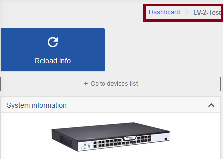 |
| | **Опція:** ІР | 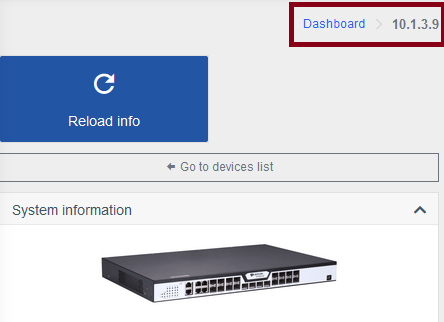 |
| **Тип статистики** | Дозволяє змінити тип відображуваної статистики пристрою. |
| | **Опція:** Окремо | 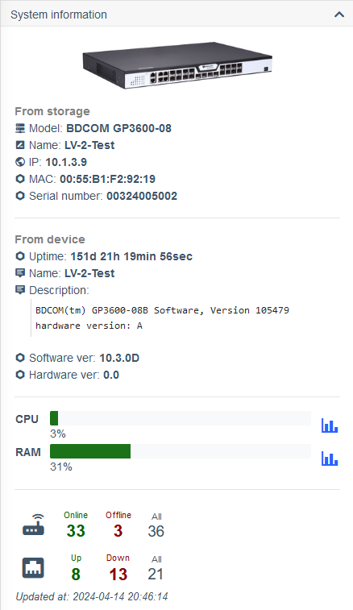 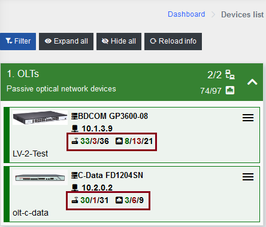|
| | **Опція:** Все | 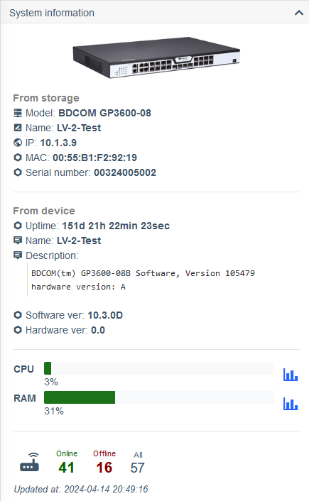 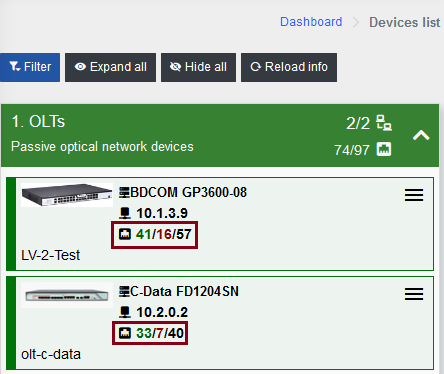 |

### Список пристроїв
| Поле | Опис | |
| ---- | ---- | - |
| **Відображати в группах** | Перемикає відображення у группах. |
| | **Опція:** Ввімкнено | 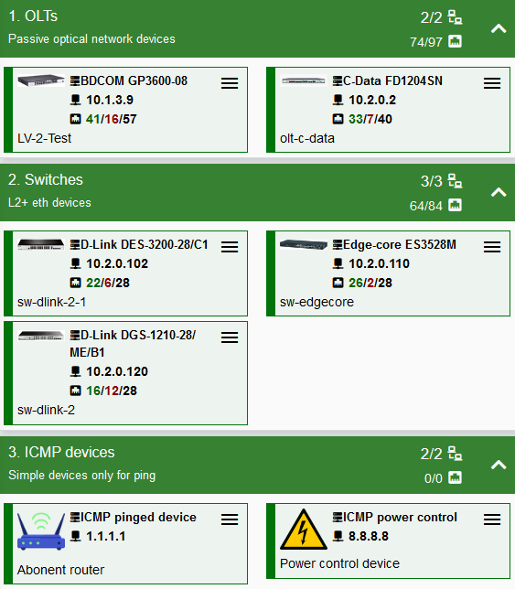 |
| | **Опція:** Вимкнено | 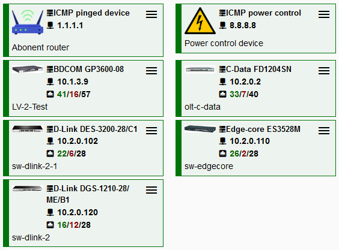 |
| **Впавші пристрої спочатку** | Перемикає відображення оффлайн пристроїв зверху інших. |
| **Сортувати по** | Дозволяє змінити тип сортування списку пристроїв. |

## Налаштування повідомлень
Повідомлення описані на [цій](../components/notifications.md) сторінці.

## Обмеження входу по IP
Цей розділ надає налаштування, пов'язані з обмеженнями входую

| Поле | Опис |
| ---- | ---- |
| **Ввімкнути обмеження по ІР** | Дозволяє обмежити ІР, з який поточний користувач може увійти до системи. |

### Конфігурація

1. Увімкніть прапорець.
2. Натисніть кнопку ++plus++, щоб додати новий запис.
3. Введіть бажану ІР адресу, а також ідентифікатор мережі у форматі CIDR. 
4. Натисніть **Зберегти**.

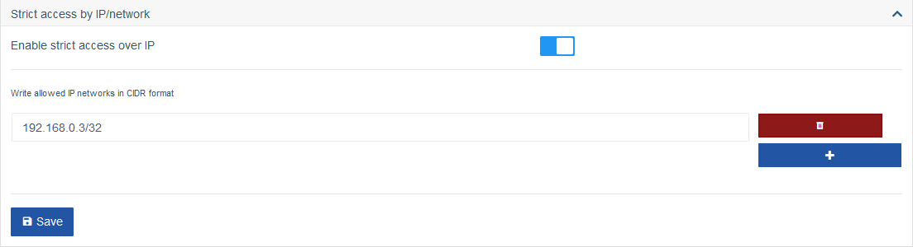

## Активні сесії
Цей розділ відображає поточні активні сесії користувача, коли він був активним востаннє, його ІР адресу та дані про пристрій, з якого вони увійшли, а також закрити активні сесії вручну.

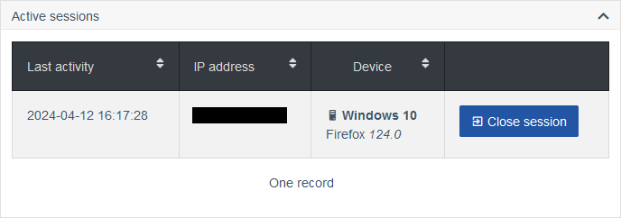